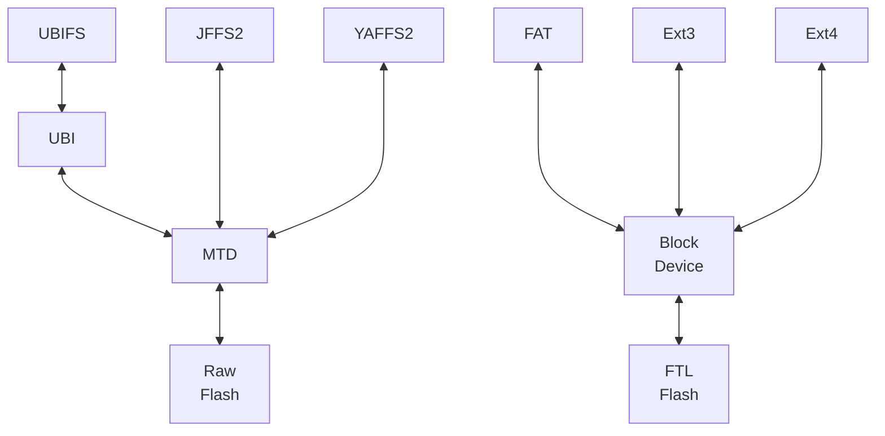

**参考资料**

* flash分类 http://www.linux-mtd.infradead.org/doc/ubifs.html#L_raw_vs_ftl
* flash文件系统性能评估 https://elinux.org/images/a/ab/Flash-filesystems.pdf
* Nandflash下各文件系统性能 https://elinux.org/images/7/7e/ELC2009-FlashFS-Toshiba.pdf

## 1. 各个文件系统镜像制作及烧写

### 1.1 实验环境

```shell
$ sudo modprobe mtdram total_size=8196 erase_size=8
$ sudo modprobe mtdblock
$ ls /dev/mtd*
/dev/mtd0  /dev/mtd0ro  /dev/mtdblock0
```
* modprobe 加载内核模块

* total_size表示mtd设备的大小，单位kb

* erase_size擦除块大小，即flash块大小 

用ram模拟制作8M，擦除块大小为8k的mtdblock

### 1.2 镜像制作过程

#### 1. jffs2

需要先下载mtd-utils

```shell
$ sudo apt install mtd-utils
```

```shell
$ mkfs.jffs2 -d mtd_test/ -o test.jffs2 -e 0x2000 -l
```
* -d 目标目录
* -o 指定镜像名
* -e 指定擦除块大小
* -l 指定小端模式

#### 2. yaffs2(not in Mainline)

第三方工具mkyaffs2imagehttps://code.google.com/archive/p/fatplus/downloads?page=2

```shell
$ ~/tool/mkyaffs2image mtd_test/ test.yaffs2

mkyaffs2image: image building tool for YAFFS2 built Jan  3 2010
Processing directory mtd_test/ into image file test.yaffs2
Object 257, mtd_test//1part is a directory
Object 258, mtd_test//2part is a directory
Operation complete.
2 objects in 3 directories
3 NAND pages
```

#### 3. UBIFS

```shell
$ mkfs.ubifs -r mtd_test/ -m 2048 -e 16384 -c 500 -o test.ubifs
```

* -r 目标目录
* -m 最小I/O单元大小
* -e 逻辑擦除块大小(最小值为15360且为最小I/O单元的整数倍)
* -c 最大逻辑块数
* 挂载的时候会报wrong fs type, bad option, bad superblock on /dev/mtdblock0, missing codepage or helper program, or other error. 查资料，可能是不能这么直接挂载。

### 1.3 镜像文件烧写

```shell
$ sudo dd if=test.jffs2 of=/dev/mtdblock0
$ sudo dd if=test.yaffs2 of=/dev/mtdblock0
$ sudo dd if=test.ubifs of=/dev/mtdblock0
```

### 1.4 挂载　　　　　　

```shell
$ sudo mount -t jffs2 /dev/mtdblock0 /mnt
$ sudo mount -t yaffs2 /dev/mtdblock0 /mnt
$ sudo mount -t ubifs /dev/mtdblock0 /mnt
$ sudo umount /dev/mtdblock0
```

## 2. mtd分区方法

### 2.0 提问这些是怎么搞出来的

```shell
# cat /proc/mtddev:    
size   erasesize  name
mtd0: 
00040000 00040000 "RedBoot"
mtd1: 
00200000 00040000 "zImage"
mtd2: 
00180000 00040000 "initramfs"
mtd3: 
00001000 00040000 "RedBoot config"
mtd4: 
00040000 00040000 "FIS directory"
# cat /proc/partitions
major minor  #blocks   name  
31        0        256 mtdblock0  
31        1       2048 mtdblock1  
31        2       1536 mtdblock2  
31        3          4 mtdblock3
31        4        256 mtdblock4
```

### 2.1 修改环境变量

```shell
"mtdparts=spi32766.0:240K(uboot)ro,16k(dtb)ro,2560k(kernel)ro,64k(param),-(rootfs) root=31:04 rw rootfstype=jffs2"
```

### 2.2 uboot中分配

在arch/arm/plat-s3c24xx/common-smdk.c中，参考《嵌入式Linux应用开发完全手册》

```c
static struct mtd_partition smdk_default_nand_part[] = {
    [0] = {
        .name = "kernel",
        .size = SZ_2M,
        .offset = 0,
    },
    [1] = {
        .name = "jffs2",
        .offset = MTDPART_OFS_APPEND,
        .size = SZ_8M,
    },
    [2] = {
        .name = "yaffs",
        .offset = MTDPART_OFS_APPEND,
        .size = MTDPART_SIZ_FULL,
    },
};
```


## 3. 文件系统性能评估(参考Toshiba nand flash官方测试)

| 性能             | JFFS2 | YAFFS2 | LogFS | UBIFS |
| ---------------- | ----- | ------ | ----- | ----- |
| 启动时间         | 差    | 较好   | 优秀  | 较好  |
| I/O性能          | 一般  | 优秀   | 较好  | 一般  |
| 资源使用率       | 一般  | 优秀   | 较好  | 一般  |
| NAND设备预期寿命 | 较好  | 一般   | N/A   | 优秀  |
| 掉电保护         | 较好  | 较好   | 差    | 较好  |

## 4. 文件系统分类(基于flash)



* Raw Flash：NAND, NOR等，这种flash没有坏块管理、均衡磨损、ecc功能，需要文件系统去实现。

* FTL Flash：EMMC，SD等，这种flash内置mcu或ASIC控制器有那些功能，因此使用传统文件系统就可以了。

* MTD子系统，屏蔽具体Flash的特性，向上提供统一接口。

## 5. mtd/分区等其他相关命令

#### mtd_debug

```shell
mtd_debug
usage: mtd_debug info <device>
       mtd_debug read <device> <offset> <len> <dest-filename>
       mtd_debug write <device> <offset> <len> <source-filename>
       mtd_debug erase <device> <offset> <len> 
#e.g.   
$ sudo mtd_debug read /dev/mtdblock0 0 0x1000 rtest
$ sudo mtd_debug write /dev/mtdblock0 0 0x1000 rtest
```

#### 查看分区使用文件类型

```shell
$ df -Th /dev/mtdblock0
```

##### fdisk

```shell
$ sudo fdisk /dev/mtdblock0
```
##### 分区表相关
| partprobe                    | 同步分区表                                                   |
| ---------------------------- | ------------------------------------------------------------ |
| sudo partx -d /dev/mtdblock0 | 清理分区表                                                   |
| sudo partx -a /dev/mtdblock0 | 重新加载分区表                                               |
| mkfs.xfs /dev/sda1           | 格式化设备为xfs文件系统（相当与在/dev/sda1上安装设备管理软件 |

## 6. 文件系统相关概念扫盲

### 6.1 日志型文件系统

概念：

* 由TxB开始，TxE结束，中间是写入的各个过程，如new data block、inode、data bitmap，整个过程叫做**transcation**.
* 记录transcation后，实际的执行更新操作，这个过程叫做checkpoint.

当分配了一个新的data block，那么inode，data bitmap以及这个新的block，这三个block都要写，而磁盘一次只能一次操作，假如其中某次写发生了crash，那么数据一致性就被破坏。就引入了日志型文件系统。

核心机制，在写数据之前，先写入一些信息，即write-ahead logging，这样在数据更新时，增加了一些工作量，但在恢复crash时，recovery工作量将大大减少。


其中barrier是为了防止在journal操作过程中crash，但会降低性能。可以在mount时指定nobarrier，不使用该功能。

### 6.2 inode(index node)

概念：

* 元信息：信息的信息，可以理解为论文的摘要
* linux系统是通过inode号码来识别不同文件的，文件名只是inode号码别名

最小存储单位-扇区(Sector)，每个扇区512字节，一般连续8sector组成一个块(Block)，块是文件存取的最小单位，一般是4kb。

inode内容

* 文件的字节数

* 文件拥有者的User ID

* 文件的Group ID

* 文件的读、写、执行权限

* 文件的时间戳，共有三个：ctime指inode上一次变动的时间，mtime指文件内容上一次变动的时间，atime指文件上一次打开的时间。

* 链接数，即有多少文件名指向这个inode

* 文件数据block的位置

**硬链接**

文件名对文件，N:1，修改任意一个文件名下的文件，其他都会跟着变，删除任意一个，都没影响。

**软链接**

一个文件的内容是另一个文件的路径，那么这个文件就叫做软连接（soft link），也叫符号链接（symbolic link）。

**bitmap**

位图，用一个位来代表一个粒度数据的分配情况

### 6.3 如何挂载文件系统

```shell
$ cat /etc/fstab		#定义的文件系统
# <file system> <mount pt>      <type>  <options>       <dump>  <pass>
/dev/root       /               ext2    rw,noauto       0       1
proc            /proc           proc    defaults        0       0
tmpfs           /tmp            tmpfs   mode=1777       0       0
sysfs           /sys            sysfs   defaults        0       0
debugfs          /sys/kernel/debug      debugfs  defaults  0 0

$ vi /etc/init.d/rcS	#开机自启动脚本中mount -a
```

