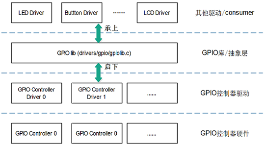
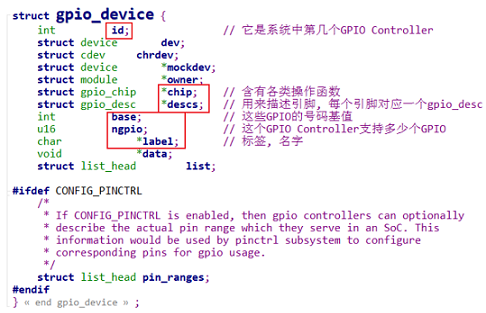
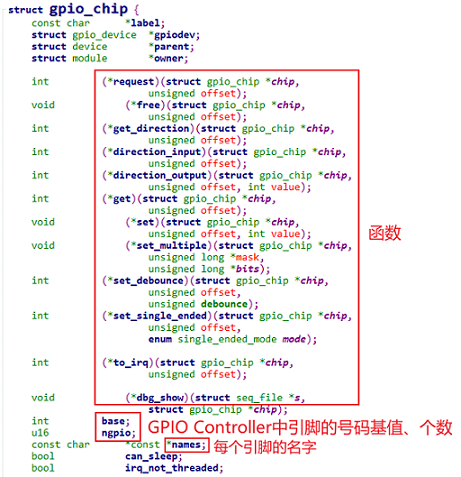
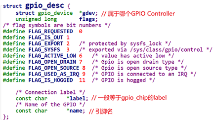
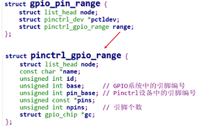

# 一、GPIO子系统层次与数据结构

### 1. GPIO子系统的层次



#### 1.1 GPIOLIB向上提供的接口

| descriptor-based(support devm) | legacy                |
| ------------------------------ | --------------------- |
| gpiod_get                      | gpio_request          |
| gpiod_get_index                |                       |
| gpiod_get_array                | gpio_request_array    |
| gpiod_direction_input          | gpio_direction_input  |
| gpiod_direction_output         | gpio_direction_output |
| gpiod_get_value                | gpio_get_value        |
| gpiod_set_value                | gpio_set_value        |
| gpio_free                      | gpio_free             |
| gpiod_put                      | gpio_free_array       |
| gpiod_put_array                |                       |


#### 1.2 GPIOLIB向下提供的接口

```c
int gpiochip_add_data(struct gpio_chip *chip, void *data)
```

### 2. 三个核心数据结构

#### 2.1 gpio_device

每个GPIO Controller用一个gpio_device来表示：



#### 2.2 gpio_chip

gpio_device无需自己创建，编写驱动时要创建的是gpio_chip：



#### 2.3 gpio_desc

我们去使用GPIO子系统时，首先是获得某个引脚对应的gpio_desc。



# 二、编写虚拟GPIO控制器驱动(4Pin)
### 1. 编写设备树文件

```shell
gpio_virt: virtual_gpiocontroller {
	compatible = "chipx,virtual_gpio";
    gpio-controller;
    #gpio-cells = <2>;
    ngpios = <4>;
};
mygpio {
    compatible = "chipx,gpiodrv";
    mygpio-gpios = <&gpio_virt 0 GPIO_ACTIVE_HIGH>;
};
```

* gpio-controller : 表明这是一个GPIO控制器
* gpio-cells : 指定除了第一个参数以外，还有多少个cell(就是整数)来描述一个引脚

### 2. 编写驱动程序（部分代码）

```c
static struct gpio_chip * g_virt_gpio;
static int virt_gpio_direction_output(struct gpio_chip *gc,unsigned offset, int val){return 0;}
static int virt_gpio_direction_input(struct gpio_chip *chip,unsigned offset){return 0;}
static int virt_gpio_get_value(struct gpio_chip *gc, unsigned offset){int val;/*...*/return val;}
static void virt_gpio_set_value(struct gpio_chip *gc,unsigned offset, int val) {}
static int virtual_gpio_probe(struct platform_device *pdev)
{
	int ret;
	u32 value;	
	g_virt_gpio = devm_kzalloc(&pdev->dev, sizeof(*g_virt_gpio), GFP_KERNEL);	/* 1. 分配gpio_chip */
	g_virt_gpio->label = pdev->name;											/* 2. 设置gpio_chip */
	g_virt_gpio->direction_output = virt_gpio_direction_output;					/* 2.1 设置函数 */
	g_virt_gpio->direction_input  = virt_gpio_direction_input;
	g_virt_gpio->get = virt_gpio_get_value;
	g_virt_gpio->set = virt_gpio_set_value;
	g_virt_gpio->parent = &pdev->dev;
	g_virt_gpio->owner = THIS_MODULE;
	g_virt_gpio->base = -1;														/* 设置ngpio base等 base取-1，由系统自动分配 */
	ret = of_property_read_u32(pdev->dev.of_node, "ngpios", &value);
	g_virt_gpio->ngpio = value;
	ret = devm_gpiochip_add_data(&pdev->dev, g_virt_gpio, NULL);				/* 3. 注册gpio_chip */
	return 0;
}
```


# 三、GPIO使用Pinctrl

**GPIO和Pinctrl的映射关系**


**数据结构**



### 1. GPIO调用Pinctrl的过程

GPIO子系统中的request函数，用来申请某个GPIO引脚，

它会导致Pinctrl子系统中的这2个函数之一被调用：`pmxops->gpio_request_enable`或`pmxops->request`，调用关系如下：

```c
gpiod_get
    gpiod_get_index
    	desc = of_find_gpio(dev, con_id, idx, &lookupflags);
		ret = gpiod_request(desc, con_id ? con_id : devname);
					ret = gpiod_request_commit(desc, label);
								if (chip->request) {
                                    ret = chip->request(chip, offset);	<==
                                }
```

`chip->request`函数，一般直接调用`gpiochip_generic_request`，它导致Pinctrl把引脚复用为GPIO功能。

```c
gpiochip_generic_request(struct gpio_chip *chip, unsigned offset)
    pinctrl_request_gpio(chip->gpiodev->base + offset)
		ret = pinctrl_get_device_gpio_range(gpio, &pctldev, &range); // gpio是引脚的全局编号
		/* Convert to the pin controllers number space */
		pin = gpio_to_pin(range, gpio);
		ret = pinmux_request_gpio(pctldev, range, pin, gpio);		//<==
					ret = pin_request(pctldev, pin, owner, range);	//<==
```

Pinctrl子系统中的pin_request函数就会把引脚配置为GPIO功能：

```c
static int pin_request(struct pinctrl_dev *pctldev,
		       int pin, const char *owner,
		       struct pinctrl_gpio_range *gpio_range)
{
    const struct pinmux_ops *ops = pctldev->desc->pmxops;
	if (gpio_range && ops->gpio_request_enable)
		/* This requests and enables a single GPIO pin */
		status = ops->gpio_request_enable(pctldev, gpio_range, pin);	//<==
	else if (ops->request)
		status = ops->request(pctldev, pin);	//<==
	else
		status = 0;
}
```

### 2. GPIO与Pinctrl之间的关系

#### 2.1 表明GPIO和Pinctrl间的联系

在GPIO设备树中使用`gpio-ranges`来描述它们之间的联系：

  * 在GPIO设备树中使用如下代码建立映射关系

    ```shell
    // 当前GPIO控制器的0号引脚, 对应pinctrlA中的32号引脚, 数量为32
    gpio-ranges = <&pinctrlA 0 32 32>; 
    ```
    

#### 2.2 解析映射关系

在GPIO驱动程序中，解析跟Pinctrl之间的联系：处理`gpio-ranges`:

  * 无需自己编写，注册gpio_chip时会自动调用

    ```c
    int gpiochip_add_data(struct gpio_chip *chip, void *data)
        status = of_gpiochip_add(chip);
    				status = of_gpiochip_add_pin_range(chip);
    of_gpiochip_add_pin_range
    	for (;; index++) {
    		ret = of_parse_phandle_with_fixed_args(np, "gpio-ranges", 3,
    				index, &pinspec);
        	pctldev = of_pinctrl_get(pinspec.np); // 根据gpio-ranges的第1个参数找到pctldev
            // 增加映射关系	
            /* npins != 0: linear range */
            ret = gpiochip_add_pin_range(chip,
                                         pinctrl_dev_get_devname(pctldev),
                                         pinspec.args[0],
                                         pinspec.args[1],
                                         pinspec.args[2]);
    ```
    


### 3. 代码编写
#### 3.1 修改设备树

```shell
pinctrl_virt: virtual_pincontroller {
            compatible = "chipx,virtual_pinctrl";
            mygpio_pin: mygpio_pin {
                            functions = "gpio";
                            groups = "pin0";
                            configs = <0x11223344>;
            };
};
gpio_virt: virtual_gpiocontroller {
	//...
    gpio-ranges = <&pinctrl_virt 0 0 4>; 
};
```

#### 3.2 GPIO控制器编程

gpio_chip中提供request函数：

```c
chip->request = gpiochip_generic_request;
```

#### 3.3 Pinctrl编程

```c
static const struct pinmux_ops virtual_pmx_ops = {
	//..
    .gpio_request_enable = virtual_pmx_gpio_request_enable,	//或者request
};
```

# 四、GPIO子系统的sysfs接口


### 1. 有哪些GPIO控制器

`/sys/bus/gpio/devices`目录下，可列出所有的GPIO控制器。

### 2. 每个GPIO控制器的详细信息

`/sys/class/gpio/gpiochipXXX`下，有这些信息：

```shell
/sys/class/gpio/gpiochip0]# ls -1
base     // 这个GPIO控制器的GPIO编号
device
label    // 名字
ngpio    // 引脚个数
power
subsystem
uevent
```

### 3. 查看GPIO使用情况

```shell
cat /sys/kernel/debug/gpio
```

### 4.使用GPIO(导出/方向/读写)

```shell
echo 44 > /sys/class/gpio/export
echo out > /sys/class/gpio/gpio44/direction
echo 1 > /sys/class/gpio/gpio44/value
echo 44 > /sys/class/gpio/unexport

echo 44 > /sys/class/gpio/export
echo in > /sys/class/gpio/gpio44/direction
cat /sys/class/gpio/gpio44/value
echo 44 > /sys/class/gpio/unexport
```