参考资料

* [linux kernel的中断子系统之（七）：GIC代码分析](http://www.wowotech.net/irq_subsystem/gic_driver.html)

#  中断相关机制

## 1 内核定时器

#### 1.0 引言

内核定时器是一种软中断，记住两大要素，就相当于掌握了寄存器，**超时时间**和**超时之后做什么**，好的驱动程序，贴合面向对象的思想，会将定时器结构体作为成员变量

#### 1.1 框架描述-旧内核

**a. 在设备自定义结构体中加入struct timer_list成员**

```c
struct xxx_dev{
	//...
	struct timer_list xxx_timer;
} ;
```

**b. 编写超时处理函数**

```c
static void xxx_timer_expire(unsigned long data)
{
	//...
}
```

**c. probe中调用setup_timer初始化定时器，包括定时器结构体及超时时间成员**

```c
setup_timer(timer, fn, data);
//e.g.
setup_timer(&xxx_dev.key_timer, key_timer_expire, &xxx_dev);
xxx_dev.xxx_timer.expires = ~0;
```

**d. 调用add_timer添加定时器**

```c
add_timer(&xxx_dev.xxx_timer);
```

**e. 中断或者需要定时的地方，调用mod_timer**

```c
int mod_timer(struct timer_list *timer, unsigned long expires);
//e.g.
mod_timer(&xxx_dev->xxx_timer, jiffies + HZ/50);	//CONFIG_HZ=100条件下，定时20ms
```

其中**jiffies**为全局变量，记录从起始到现在经过了多少滴答，滴答由CONFIG_HZ来设置。

**f. remove，调用del_timer删除定时器**

```c
int del_timer(struct timer_list *timer);
```

其中**jiffies**为全局变量，记录从起始到现在经过了多少滴答，滴答由CONFIG_HZ来设置。

#### 1.2 框架描述-新内核需要修改

+ **超时处理函数需要修改**

```c
static void key_timer_expire(struct timer_list *t)
{
	struct xxx_dev *xxx_dev_m = from_timer(xxx_dev_m, t, xxx_timer);
	//...
}
```

+ **初始化定时器函数发生变化**

```c
void timer_setup(struct timer_list *timer,void (*callback)(struct timer_list *),unsigned int flags);
```

参数flags一般取NULL，/include/linux/timer.h + 60，等后期实际项目遇到了再填坑。

该函数无法直接传入data，只能在超时回调函数中通过参量**t**进行间接提取。

+ **在超时回调函数中调用from_timer函数反推数据**

```c
from_timer(var, callback_timer, timer_fieldname)
```

参数**var**表示需要反推的变量，参数**callback_timer**表示timer_list，参数**timer_fieldname**表示定时器在数据结构体中的名字。

## 2 中断下半部-tasklet

#### 2.0 引言

**taklet**是一种软件中断，它用于解决硬件中断不好处理的一些费时工作，在使用过程中，可以在硬件中断中调度**tasklet**，由内核自动完成**tasklet**的运行，同一硬件中断无论发生多少次，**tasklet**只会执行一次，因此是多对一的关系。

#### 2.1 框架描述

**a. 定义tasklet_struct结构体**

```c
struct tasklet_struct tasklet;
```

**b. 定义tasklet处理函数**

```c
static void xxx_tasklet_func(unsigned long data){	//...}
```

**c. probe函数调用tasklet_init初始化tasklet**

```c
void tasklet_init(struct tasklet_struct *t, void (*func)(unsigned long), unsigned long data);//e.g.tasklet_init(&tasklet, xxx_tasklet_func, &data);
```

**d. 在中断服务程序中调用tasklet_schedule调度tasklet，即把tasklet放入队列**

```c
void tasklet_schedule(struct tasklet_struct *tasklet);
```

**e. remove函数调用tasklet_kill注销tasklet**

```c
void tasklet_kill(struct tasklet_struct *t);
```

## 3 工作队列-workqueue

#### 3.0 引言

无论是**硬中断**还是**tasklet**，进程都会陷入内核态一直执行，此时如果用户态需要进行一些紧急的事情，就要使用一种新的机制来解决这种应用场景，这种机制叫做**工作队列**，该机制会使用内核线程执行内核态代码，用户态可以与内核态平等的竞争执行机会。**既然是队列**，需要排队执行任务，因此这种机制不适合处理耗时较长的工作，对于这种，就单独的创建线程吧。

#### 3.1 框架描述

**a. 定义work_struct结构体**

```c
struct work_struct m_work;
```

**b. 定义work处理函数**

```c
static void xxx_work_func(struct work_struct *work){	struct gpio_key *gpio_key = container_of(work, struct xxx_dev, m_work);}
```

**c. 调用INIT_WORK初始化work_struct**

```c
INIT_WORK(m_work, xxx_work_func);
```

**d. 在中断服务程序中调用schedule_work调度work，即把work放入队列**

```c
bool schedule_work(struct work_struct *work);
```

## 4 中断的线程化处理

#### 4.0 引言

中断的线程化处理就是解决**工作队列**把所有**work**全都挤在一个线程的问题，使中断能有自己的线程来执行下半部代码。

#### 4.1 框架描述

**a. 定义中断上半部处理函数，并返回IRQ_WAKE_THREAD**

```c
static irqreturn_t xxx_isr(int irq, void *dev_id){	//...	return IRQ_WAKE_THREAD;}
```

**b. 定义中断下半部处理函数，并返回IRQ_HANDLED**

```c
static irqreturn_t xxx_thread_func(int irq, void *dev_id){	//...		return IRQ_HANDLED;}
```

**c. probe函数中调用request_threaded_irq初始化中断**

```c
int request_threaded_irq(unsigned int irq, irq_handler_t handler,			 irq_handler_t thread_fn, unsigned long irqflags,			 const char *devname, void *dev_id);//e.g.err = request_threaded_irq(irq, xxx_isr, xxx_thread_func, IRQF_TRIGGER_RISING, "xxx", &data);
```

其中参数**irq**代表中断号，参数**irqflags**代表触发中断的条件，对于GPIO有**IRQF_TRIGGER_RISING**和**IRQF_TRIGGER_FALLING**。
**d. remove函数中调用free_irq释放中断**

```c
void free_irq(unsigned int irq, void *dev_id);
```

# 中断触发流程

## 0. 中断框架(GPIO为例)

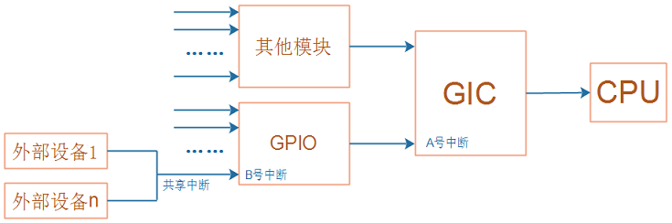

## 1. GPIO控制器

[GPIO寄存器](..\submd\GPIO寄存器.md) 

## 2. GIC(General Interrupt Controller)

* GIC由分发器(Distributor)与CPU接口单元(CPU Interface)构成

* 中断类型

  | Type                              | Interrupt ID |
  | --------------------------------- | ------------ |
  | SGI(Software Generated Interrup)  | 0-15         |
  | PPI(Private Peripheral Interrupt) | 16-31        |
  | SPI(Shared Peripheral Interrupt)  | 31-1020      |

* 中断可以处于多种不同状态

  | status                           | Description              |
  | -------------------------------- | ------------------------ |
  | 非活动状态（Inactive             | 未触发                   |
  | 挂起（Pending）                  | 已被触发，等待CPU处理    |
  | 活动（Active）                   | 正在被处理               |
  | 活动且挂起（Active and pending） | 被其他中断打断，等待恢复 |

### 2.1 Distributor可配置属性

**中断优先级** **中断触发类型** **中断分发到哪个核** **中断启用或禁用状态** **中断安全性** **中断状态**


### 2.2 使能流程

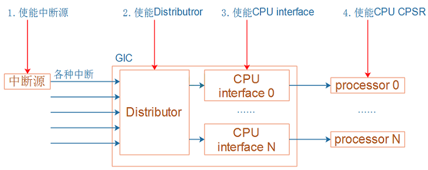


## 3. CPU

CPU的CPSR寄存器中有一位：I位，用来使能/禁止中断。

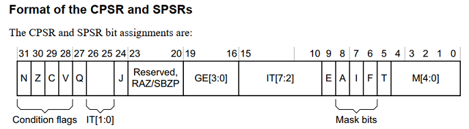

可以使用以下汇编指令修改I位：

```
  CPSIE I  ; 清除I位，使能中断
  CPSID I  ; 设置I位，禁止中断
```

# 中断处理流程
* CPU执行完当前指令，检查到发生了中断，跳到向量表
* 保存现场、执行GIC提供的处理函数、恢复现场

## 1. 异常向量表的安装与调用

### 1.1 异常向量表的安装

* 汇编代码

```c
// arch\arm\kernel\head.S
1. bl	__lookup_processor_type
   ...... 
2. bl	__create_page_tables
3. ldr	r13, =__mmap_switched
4. b	__enable_mmu
   b	__turn_mmu_on
   mov	r3, r13
   ret	r3
5. __mmap_switched: // arch\arm\kernel\head-common.S
6. b	start_kernel
```

* 复制向量表

```c
start_kernel // init/main.c
    setup_arch(&command_line); // arch/arm\kernel/setup.c
		paging_init(mdesc);    // arch/arm/mm/mmu.c
			devicemaps_init(mdesc); // arch/arm/mm/mmu.c
				vectors = early_alloc(PAGE_SIZE * 2); // 1.分配新向量表
				early_trap_init(vectors);             // 2.从代码把向量表复制到新向量表
				// 3. 映射新向量表到虚拟地址0xffff0000
                map.pfn = __phys_to_pfn(virt_to_phys(vectors));
                map.virtual = 0xffff0000;
                map.length = PAGE_SIZE;
            #ifdef CONFIG_KUSER_HELPERS
                map.type = MT_HIGH_VECTORS;
            #else
                map.type = MT_LOW_VECTORS;
            #endif
                create_mapping(&map);
```

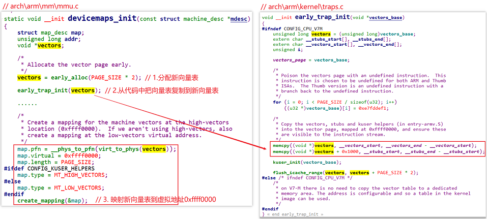

向量表位于`__vectors_start`，它在`arch/arm/kernel/vmlinux.lds`中定义：

```shell
 __vectors_start = .;
 .vectors 0xffff0000 : AT(__vectors_start) {
  *(.vectors)
 }
 . = __vectors_start + SIZEOF(.vectors);
 __vectors_end = .;
 __stubs_start = .;
 .stubs ADDR(.vectors) + 0x1000 : AT(__stubs_start) {
  *(.stubs)
 }
```

在代码里搜`.vectors`，可以找到向量表/arch/arm/kernel/entry-armv.S：

```assembly
	.section .vectors, "ax", %progbits
.L__vectors_start:
	W(b)	vector_rst
	W(b)	vector_und
	W(ldr)	pc, .L__vectors_start + 0x1000
	W(b)	vector_pabt
	W(b)	vector_dabt
	W(b)	vector_addrexcptn
	W(b)	vector_irq
	W(b)	vector_fiq
```

### 1.2 中断向量

发生中断时，CPU跳到向量表去执行`b vector_irq`。

vector_irq函数使用宏来定义：

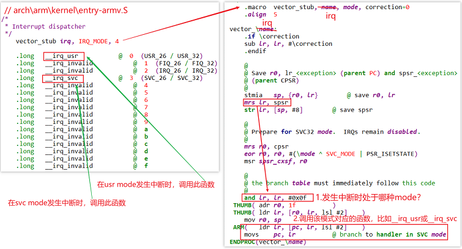

### 1.3 处理流程

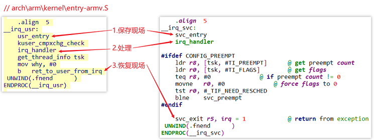

### 1.4 处理函数

/arch/arm/kernel/entry-armv.S

```assembly
	.macro	irq_handler
#ifdef CONFIG_MULTI_IRQ_HANDLER
	ldr	r1, =handle_arch_irq	#<=GIC驱动提供
	mov	r0, sp
	badr	lr, 9997f
	ldr	pc, [r1]
#else
	arch_irq_handler_default
#endif
9997:
	.endm
```

## 2. GIC驱动程序对中断的处理流程

* 对于irq_desc，内核有两种分配方法：legacy(一次性分配)、linear(按需)
* 假设GIC可以向CPU发出16~1019号中断，这些数字被称为hwirq。0~15用于Process之间通信。

### 2.1 一级中断控制器处理流程


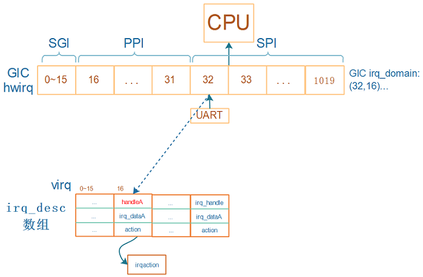

* 假设要使用UART模块，它发出的中断连接到GIC的32号中断，分配的irq_desc序号为16
* 在GIC domain中会记录(32, 16)
* 那么注册中断时就是：`request_irq(16, ...)`
* 发生UART中断时
  * 程序从GIC中读取寄存器知道发生了32号中断，通过GIC irq_domain可以知道virq为16
  * 调用irq_desc[16]中的handleA函数，它的作用是调用action链表中用户注册的函数

### 2.2 多级中断控制器处理流程

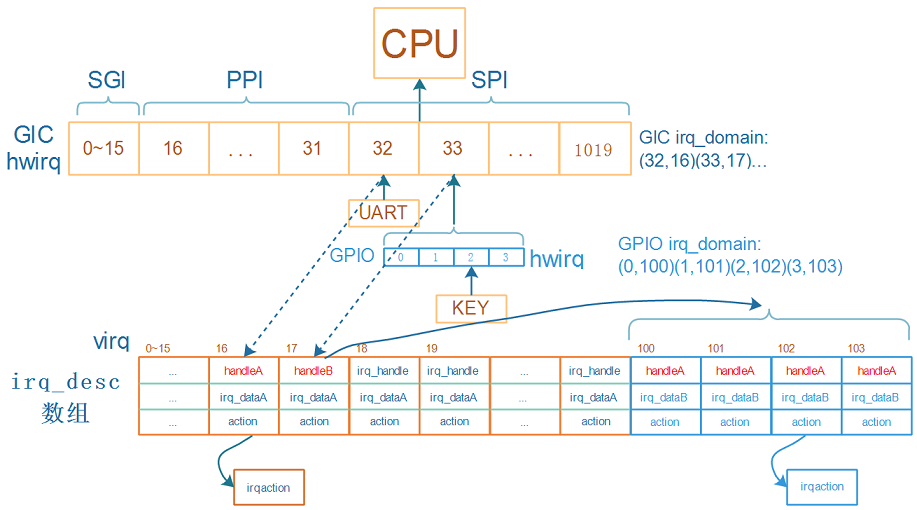

* 假设GPIO模块下有4个引脚，都可以产生中断，都连接到GIC的33号中断

* GPIO也可以看作一个中断控制器，对于它的4个中断

* 对于GPIO模块中0~3这四个hwirq，一般都会一下子分配四个irq_desc

* 假设这4个irq_desc的序号为100~103，在GPIO domain中记录(0,100) (1,101)(2,102) (3,103)

* 对于KEY，注册中断时就是：`request_irq(102, ...)`

* 按下KEY时：

  * 程序从GIC中读取寄存器知道发生了33号中断，通过GIC irq_domain可以知道virq为16

  * 调用irq_desc[16]中的handleB函数

    * handleB读取GPIO寄存器，确定是GPIO里2号引脚发生中断

    * 通过GPIO irq_domain可以知道virq为102

    * 调用irq_desc[102]中的handleA函数，它的作用是调用action链表中用户注册的函数

### 2.3 GIC中的重要函数和结构体

沿着中断的处理流程，GIC涉及这4个重要部分：

* CPU从异常向量表中调用handle_arch_irq，这个函数指针是由GIC驱动设置的
  * GIC才知道怎么判断发生的是哪个GIC中断
* 从GIC获得hwirq后，要转换为virq：需要有GIC Domain
* 调用irq_desc[virq].handle_irq函数：这也应该由GIC驱动提供
* 处理中断时，要屏蔽中断、清除中断等：这些函数保存在irq_chip里，由GIC驱动提供

从硬件上看，GIC的功能是什么？

* 可以使能、屏蔽中断
* 发生中断时，可以从GIC里判断是哪个中断

在内核里，使用gic_chip_data结构体表示GIC，gic_chip_data里有什么？

* irq_chip：中断使能、屏蔽、清除，放在irq_chip中的各个函数里实现

  ```c
  //drivers/irqchip/irq-gic.c
  static struct irq_chip gic_chip = {
  	.irq_mask		= gic_mask_irq,
  	.irq_unmask		= gic_unmask_irq,
  	.irq_eoi		= gic_eoi_irq,	//清除中断
  	.irq_set_type		= gic_set_type,
  	.irq_get_irqchip_state	= gic_irq_get_irqchip_state,
  	.irq_set_irqchip_state	= gic_irq_set_irqchip_state,
  	.flags			= IRQCHIP_SET_TYPE_MASKED |
  				  IRQCHIP_SKIP_SET_WAKE |
  				  IRQCHIP_MASK_ON_SUSPEND,
  };
  ```

* irq_domain
  * 申请中断时
    * 在设备树里指定hwirq、flag，可以使用irq_domain的函数来解析设备树
    * 根据hwirq可以分配virq，把(hwirq, virq)存入irq_domain中
  * 发生中断时，从GIC读出hwirq，可以通过irq_domain找到virq，从而找到处理函数

所以，GIC用gic_chip_data来表示，gic_chip_data中重要的成员是：irq_chip、irq_domain。

### 2.4 GIC初始化过程

```c
start_kernel (init\main.c)
    init_IRQ (arch\arm\kernel\irq.c)
    	irqchip_init (drivers\irqchip\irqchip.c)
    		of_irq_init (drivers\of\irq.c)
    			desc->irq_init_cb = match->data;
                ret = desc->irq_init_cb(desc->dev,
                            desc->interrupt_parent);
```

#### 内核支持多种GIC

按照设备树的套路：

* 驱动程序注册platform_driver
* 它的of_match_table里有多个of_device_id，表示能支持多个设备
* 有多种版本的GIC，在内核为每一类GIC定义一个结构体of_device_id，并放在一个段里：

```c
// drivers\irqchip\irq-gic.c
//...
IRQCHIP_DECLARE(cortex_a9_gic, "arm,cortex-a9-gic", gic_of_init);
IRQCHIP_DECLARE(cortex_a7_gic, "arm,cortex-a7-gic", gic_of_init);
//...
```

把宏`IRQCHIP_DECLARE`展开：

```c
// include\linux\irqchip.h
#define IRQCHIP_DECLARE(name, compat, fn) OF_DECLARE_2(irqchip, name, compat, fn)

#define OF_DECLARE_2(table, name, compat, fn) \
		_OF_DECLARE(table, name, compat, fn, of_init_fn_2)

#define _OF_DECLARE(table, name, compat, fn, fn_type)			\
	static const struct of_device_id __of_table_##name		\
		__used __section(__irqchip_of_table)			\
		 = { .compatible = compat,				\
		     .data = (fn == (fn_type)NULL) ? fn : fn  }
```

```c
IRQCHIP_DECLARE(cortex_a7_gic, "arm,cortex-a7-gic", gic_of_init);
//展开后得到：
static const struct of_device_id __of_table_cortex_a7_gic		\
	__used __section(__irqchip_of_table)			\
	 = { .compatible = "arm,cortex-a7-gic",				\
		 .data = gic_of_init  }
```

#### 在设备树里指定GIC

在设备树中指定GIC，内核驱动程序根据设备树来选择、初始化GIC。

`drivers\irqchip\irqchip.c`中并没有定义一个platform_driver，但是套路是一样的。

```c
void __init irqchip_init(void)
{
	of_irq_init(__irqchip_of_table);
	acpi_probe_device_table(irqchip);
}
```

调用过程：

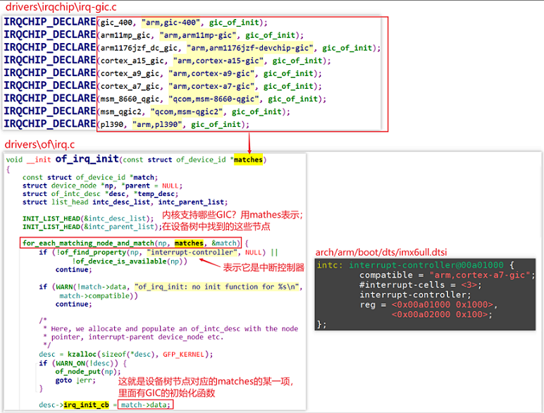

of_irq_init:

* 内核有一个__irqchip_of_table数组，里面有多个of_device_id，表示多种GIC
* 要使用哪类GIC？在设备树里指定
* 根据设备树，找到__irqchip_of_table树组中对应的项，调用它的初始化函数
  * `IRQCHIP_DECLARE(cortex_a7_gic, "arm,cortex-a7-gic", gic_of_init);` 

#### gic_of_init分析

...

### 2.5 申请GIC中断

#### 在设备树里指定中断

```c
// arch/arm/boot/dts/imx6ull.dtsi
gpc: gpc@020dc000 {
    compatible = "fsl,imx6ul-gpc", "fsl,imx6q-gpc";
    ret = <0x020dc000 0x4000>;
    interrupt-controller;
    #interrupt-cells = <3>;
    interrupts = <GIC_SPI 89 IRQ_TYPE_LEVEL_HIGH>;
    interrupt-parent = <&intc>;
    fsl,mf-mix-wakeup-irq = <0xfc00000 0x7d00 0x0 0x1400640>;
};
```

#### 内核对设备树的处理

函数调用过程如下：

* 为设备树节点分配设备   

  ```c
  of_device_alloc (drivers/of/platform.c)
      dev = platform_device_alloc("", -1);  // 分配 platform_device   
      num_irq = of_irq_count(np);  // 计算中断数    
  	// drivers/of/irq.c, 根据设备节点中的中断信息, 构造中断资源
  	of_irq_to_resource_table(np, res, num_irq) 
          of_irq_to_resource // drivers\of\irq.c
          	int irq = irq_of_parse_and_map(dev, index);  // 获得virq, 中断号
  ```
  
* 解析设备树映射中断: irq_of_parse_and_map

  ```c
  // drivers/of/irq.c, 解析设备树中的中断信息, 保存在of_phandle_args结构体中
  of_irq_parse_one(dev, index, &oirq)
  // kernel/irq/irqdomain.c, 创建中断映射
  irq_create_of_mapping(&oirq);             
  	irq_create_fwspec_mapping(&fwspec);
  		// 调用irq_domain->ops的translate或xlate,把设备节点里的中断信息解析为hwirq, type
  		irq_domain_translate(domain, fwspec, &hwirq, &type)  
  		// 看看这个hwirq是否已经映射, 如果virq非0就直接返回
  		virq = irq_find_mapping(domain, hwirq); 
  		// 否则创建映射	
  		if (irq_domain_is_hierarchy(domain)) {
  			// 返回未占用的virq
  			// 并用irq_domain->ops->alloc函数设置irq_desc
  			virq = irq_domain_alloc_irqs(domain, 1, NUMA_NO_NODE, fwspec);
  			if (virq <= 0)
  				return 0;
  		} else {
  			/* Create mapping */
  			// 返回未占用的virq
  			// 并通过irq_domain_associate调用irq_domain->ops->map设置irq_desc
  			virq = irq_create_mapping(domain, hwirq);
              if (!virq)
                      return virq;
  		}
  ```

# 两类中断控制器处理流程

## 1. 下级中断控制器的类别

中断控制器分为两类：链式(chained)、层级(hierarchy)。

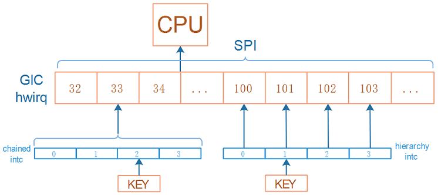

## 2. 链式中断控制器

### 2.1 处理流程
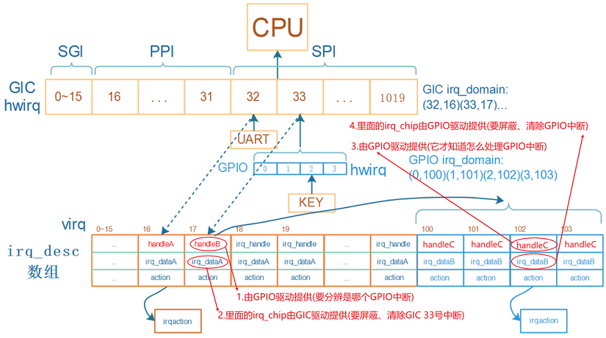

**重要部分：**handleB、GPIO Domain、handleC、irq_chip

* **handleB**：处理GIC 33号中断，handleB由GPIO驱动提供
  * 屏蔽GIC 33号中断：调用irq_dataA的irq_chip的函数，irq_dataA由GIC驱动提供
  * 细分并处理某个GPIO中断：
    * 读取GPIO寄存器得到hwirq，通过**GPIO Domain**转换为virq，假设是102
    * 调用irq_desc[102].handle_irq，即handleC
  * 清除GIC 33号中断：调用irq_dataA的irq_chip的函数，由GIC驱动提供
  
* **handleC**：处理GPIO 2号中断，handleC由GPIO驱动提供

  * 屏蔽GPIO 2号中断：调用irq_dataB的**irq_chip**的函数，由GPIO驱动提供
  * 处理：调用actions链表中用户注册的函数
  * 清除GPIO 2号中断：调用irq_dataB的irq_chip的函数，由GPIO驱动提供


**irq_domain的核心作用**

  怎么把handleB、GPIO Domain、handleC、irq_chip这4个结构体组织起来，irq_domain是核心。

  中断的流程如下：

  * 在设备树里指定使用哪个中断

  * 内核解析、处理设备树的中断信息

    * 根据`interrupt-parent`找到驱动程序注册的irq_domain
    * 使用irq_domain.ops中的translate或xlate函数解析设备树，得到hwirq和type

    * 分配/找到irq_desc，得到virq
      * 把(hwirq, virq)的关系存入irq_domain
      * 把virq存入platform_device的resource中
    * 使用irq_domain.ops中的alloc或map函数进行设置
      * 可能是替换irq_desc[virq].handle_irq函数
      * 可能是替换irq_desc[virq].irq_data，里面有irq_chip

  * 用户的驱动程序注册中断

    * 从platform_device的resource中得到中断号virq
    * request_irq(virq, ..., func)

  * 发生中断、处理中断：处理流程见上面。

### 2.2 虚拟中断控制器

**设备树**

```shell
/{
	virtual_intc: virtual_intc_chipx {
		compatible = "chipx,virtual_intc";
		interrupt-controller;
		#interrupt-cells = <2>;
		interrupt-parent = <&intc>;
		interrupts = <GIC_SPI 122 IRQ_TYPE_LEVEL_HIGH>;
	};
};
```

**代码**

  [virtual_int_controller_chained.c](code\int\virtual_int_controller_chained.c)  [gpio_key_drv.c](code\int\gpio_key_drv.c) 

### 2.3 测试

| 芯片    | SPI中断号 | GIC中断号 | n,bit | GICD_ISPENDRn地址 | 命令                         |
| ------- | --------- | --------- | ----- | ----------------- | ---------------------------- |
| IMX6LLL | 122       | 154       | 4,26  | 0xa01210          | devmem 0xa01210 32 0x4000000 |

## 3. 层级中断控制器
### 3.1 处理流程
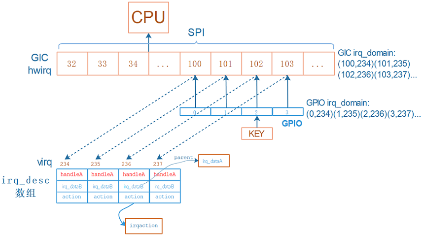

**重要部分：**irq_dataB、GPIO Domain、irq_chip

* 假设这4个irq_desc的序号为234~237
  * 在GIC domain中记录(100,234) (101,235)(102,236) (103,237)
  * 在GPIO domain中记录(0,234) (1,235)(2,236) (3,237)
* 对于KEY，注册中断时就是：`request_irq(236, ...)`
* 按下KEY时：
  * 程序从GIC中读取寄存器知道发生了102号中断，通过GIC irq_domain可以知道virq为236
  * 处理virq 236号中断：调用irq_desc[236].handle_irq，即handleA
    * mask/ack中断: 
      * 调用irq_desc[236].irq_data->irq_chip的函数，即irq_dataB
        * 它会调用父级irq_dataA->irq_chip的函数
    * 调用irq_desc[236].action链表中用户注册的函数
    * unmask中断: 
      * 调用irq_desc[236].irq_data->irq_chip的函数，即irq_dataB
        * 它会调用父级irq_dataA->irq_chip的函数

**irq_domain的核心作用**

怎么把handleA、GIC Domain和GPIO Domain、irq_chipA和irq_chipB这4个结构体组织起来，irq_domain是核心。

中断的流程如下：

* 在设备树里指定使用哪个中断

* 内核解析、处理设备树的中断信息

  * 根据`interrupt-parent`找到驱动程序注册的GPIO irq_domain
  * GPIO irq_domain对设备树的解析
    * 使用GPIO irq_domain.ops中的translate或xlate函数解析设备树，得到hwirq和type
    * 分配/找到irq_desc，得到virq
      * 把(hwirq, virq)的关系存入GPIO irq_domain
      * 把virq存入platform_device的resource中
    * 修改得到对应的GIC_hwirq，调用父级GIC irq_domain继续解析
      * 把(GIC_hwirq, virq)的关系存入GIC irq_domain
    * **注意**：对于同一个硬件中断，它在两个irq_domain里的virq是相同的，hwirq可能不一样。
  * GPIO irq_domain对设备树的设置
    * 使用GPIO irq_domain.ops中的alloc函数进行设置
      * 替换irq_desc[virq].irq_data，里面有irq_chip改为irq_chipB，即GPIO的irq_chip
      * 调用父级GIC irq_domain的alloc继续设置
        * 设置irq_desc[virq].handle_irq为GIC的handle_irq，即上图中的handleA

* 用户的驱动程序注册中断

  * 从platform_device的resource中得到中断号virq
  * request_irq(virq, ..., func)

* 发生中断、处理中断：处理流程见上面。


### 3.2 虚拟中断控制器

**设备树**

```shell
/{
	virtual_intc: virtual_intc_chipx {
		compatible = "chipx,virtual_intc";
		interrupt-controller;
		#interrupt-cells = <2>;
		interrupt-parent = <&intc>;
		upper_hwirq_base = <123>;
	};
};
```

**代码**

 [virtual_int_controller_hierarchy.c](code\int\virtual_int_controller_hierarchy.c)  [gpio_key_drv.c](code\int\gpio_key_drv.c) 

### 3.3 测试

| 芯片    | SPI中断号 | GIC中断号 | n,bit | GICD_ISPENDRn地址 | 命令                          |
| ------- | --------- | --------- | ----- | ----------------- | ----------------------------- |
| IMX6LLL | 122       | 154       | 4,26  | 0xa01210          | devmem 0xa01210 32 0x4000000  |
|         | 123       | 155       | 4,27  | 0xa01210          | devmem 0xa01210 32 0x8000000  |
|         | 124       | 156       | 4,28  | 0xa01210          | devmem 0xa01210 32 0x10000000 |
|         | 125       | 157       | 4,29  | 0xa01210          | devmem 0xa01210 32 0x20000000 |

## 4. 处理流程对比

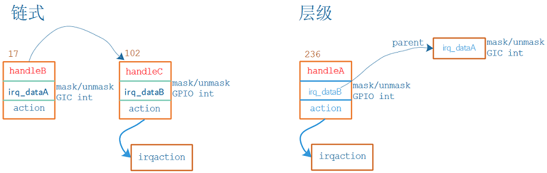
