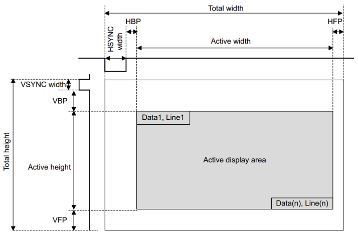
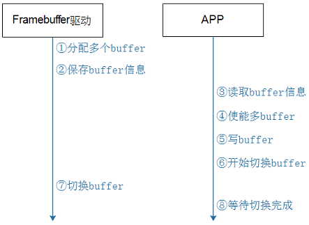
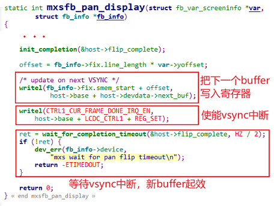

参考资料：

* MIPI-DSI、MIPI-CSI、LVDS等接口解析：https://blog.csdn.net/u014470361/article/details/88891255
* drivers\video\fbdev\s3c2410fb.c
* Linux-4.9.88\drivers\video\fbdev\mxsfb.c

## 0. 基本概念

* bpp：bits per pixel，24bpp实际占用还是32bits
* xres、yres代表横纵像素个数
* Line_width = xres * bpp / 8; pixel_width = bpp / 8;
* MIPI（Mobile Industry Processor Interface）标准，LCD及摄像头的主流标准

  * MIPI-DBI (Display Bus Interface)  (LCM)

    * 8080接口，即MPU，MPU+VSYNC

    * Type B (i-80 system), 8-/9-/16-/18-/24-bit bus  

    * Type C (Serial data transfer interface, 3/4-line SPI)  
    
   * MIPI-DPI (Display Pixel Interface) --TFT RGB
  
   * MIPI-DSI (Display Serial Interface)  
  
## 1. 显示字符

| 字符集      | 描述                                                         |
| ----------- | ------------------------------------------------------------ |
| ANSI        | 一种跟随系统语言的字符集代称，简体系统就是gbk/gb2132，繁体就是big5 |
| Unicode系列 | 含UTF-16 LE、UTF-16 BE、UTF-8，前两者为2字节大小端不同，后者扩充为3字节，加入校验信息，确保传输稳定 |
| ASCII       | American Standard Code for Information Interchange 127个字符 |

* 可通过wchar_t来指定字符串，则结果都会是unicode

* 中文字符定位（区位码），loc = (d6-a1)*94 + (d0-a1) =>94代表一个区有94个字符

* 矢量字体，|Charmaps|A|B|---|中|---|国|---|，每个数据项都是一个glyph(轮廓)，显示流程如下

  * 给定一个字符可以确定它的编码值

  * 设置字体大小

  * 根据编码值，从文件头部通过charmap找到对应的关键点(glyph)，它会根据字体大小调整关键点

  * 把关键点转换为位图点阵

  * 在LCD上显示出来

* freetype工具，从 http://www.freetype.org 下载到"freetype-doc-2.10.2.tar.xz"，为参考代码及文档

* 参考step2.html可知道如何显示多行数据，简言之，横向origin + advance = next origin，纵向baseline。

* 示例代码  [show_line.c](code\lcd\show_line.c)  [simsun.ttc](code\lcd\simsun.ttc)  [示例代码.c](code\lcd\示例代码.c) 

## 2. Framebuffer(GRam)驱动程序框架

### 2.1 重要结构体

```c
struct fb_info {
    ...
	struct fb_var_screeninfo var;	/* Current var */
	struct fb_fix_screeninfo fix;	/* Current fix */
    ...
    struct fb_ops *fbops;
    ...
};
struct fb_var_screeninfo {
	__u32 xres;			/* visible resolution		*/
	__u32 yres;
	__u32 xres_virtual;		/* virtual resolution		*/
	__u32 yres_virtual;
	__u32 xoffset;			/* offset from virtual to visible */
	__u32 yoffset;			/* resolution			*/
	__u32 bits_per_pixel;		/* guess what			*/
	...
	struct fb_bitfield red;		/* bitfield in fb mem if true color, */
	struct fb_bitfield green;	/* else only length is significant */
	struct fb_bitfield blue;
	...
};
struct fb_fix_screeninfo {
	char id[16];			/* identification string eg "TT Builtin" */
	unsigned long smem_start;	/* Start of frame buffer mem */
					/* (physical address) */
	__u32 smem_len;			/* Length of frame buffer mem */
	__u32 type;			/* see FB_TYPE_*		*/
	...
	__u32 visual;			/* see FB_VISUAL_*		*/ 
	...
	__u32 line_length;		/* length of a line in bytes    */
	...
};
struct fb_ops {
	...
	/* set color register */
	int (*fb_setcolreg)(unsigned regno, unsigned red, unsigned green,
			    unsigned blue, unsigned transp, struct fb_info *info);
	...
	/* pan display */
	int (*fb_pan_display)(struct fb_var_screeninfo *var, struct fb_info *info);
	/* Draws a rectangle */
	void (*fb_fillrect) (struct fb_info *info, const struct fb_fillrect *rect);
	/* Copy data from area to another */
	void (*fb_copyarea) (struct fb_info *info, const struct fb_copyarea *region);
	/* Draws a image to the display */
	void (*fb_imageblit) (struct fb_info *info, const struct fb_image *image);
	...
};
```

### 2.2 TFT-RGB接口时序参数



### 2.3 硬件相关的代码

* GPIO设置：LCD引脚、背光引脚

* 时钟设置：确定LCD控制器的时钟、根据LCD的DCLK计算相关时钟

* LCD控制器本身的设置：设置Framebuffer的地址、设置Framebuffer中数据格式、LCD数据格式、设置时序

### 2.4 设备树

```c
framebuffer-mylcd {
    compatible = "chipx,lcd_drv";
    pinctrl-names = "default";
    pinctrl-0 = <&mylcd_pinctrl>;
    backlight-gpios = <&gpio1 8 GPIO_ACTIVE_HIGH>;
    clocks = <&clks IMX6UL_CLK_LCDIF_PIX>,
    <&clks IMX6UL_CLK_LCDIF_APB>;
    clock-names = "pix", "axi";
    display = <&display0>;
    display0: display {
        bits-per-pixel = <24>;
        bus-width = <24>;
        display-timings {
            native-mode = <&timing0>;
            timing0: timing0_1024x768 {
                clock-frequency = <50000000>;
                hactive = <1024>;
                vactive = <600>;
                hfront-porch = <160>;
                hback-porch = <140>;
                hsync-len = <20>;
                vback-porch = <20>;
                vfront-porch = <12>;
                vsync-len = <3>;
                hsync-active = <0>;
                vsync-active = <0>;
                de-active = <1>;
                pixelclk-active = <0>;
            };
        };
    };            
};
```

### 2.5 示例代码

 [lcd_drv.c](code\lcd\lcd_drv.c)  [100ask_imx6ull-14x14.dts](code\lcd\100ask_imx6ull-14x14.dts) 

## 3. 多buffer的引入

使用单buffer会造成LCD控制器与应用程序同时使用一片内存，容易造成冲突问题，若APP过快则闪屏，过慢则延迟，采用多buffer就能很好的解决。

基本流程如下：



* 驱动：分配多个buffer

  ```c
  fb_info->fix.smem_len = SZ_32M;
  fbi->screen_base = dma_alloc_writecombine(fbi->device,
  				fbi->fix.smem_len,
  				(dma_addr_t *)&fbi->fix.smem_start,
  				GFP_DMA | GFP_KERNEL);
  ```

* 驱动：保存buffer信息

  ```c
  fb_info->fix.smem_len  // 含有总buffer大小 
  fb_info->var           // 含有单个buffer信息
  ```

* APP：读取buffer信息

  ```c
  ioctl(fd_fb, FBIOGET_FSCREENINFO, &fix);
  ioctl(fd_fb, FBIOGET_VSCREENINFO, &var);
  // 计算是否支持多buffer，有多少个buffer
  screen_size = var.xres * var.yres * var.bits_per_pixel / 8;
  nBuffers = fix.smem_len / screen_size;
  ```

* APP：使能多buffer

  ```c
  var.yres_virtual = nBuffers * var.yres;
  ioctl(fd_fb, FBIOPUT_VSCREENINFO, &var);
  ```

* APP：写buffer

  ```c
  fb_base = (unsigned char *)mmap(NULL , fix.smem_len, PROT_READ | PROT_WRITE, MAP_SHARED, fd_fb, 0);
  /* get buffer */
  pNextBuffer =  fb_base + nNextBuffer * screen_size;
  /* set buffer */
  lcd_draw_screen(pNextBuffer, colors[i]);
  ```
  
* APP：开始切换buffer

  ```c
  /* switch buffer */
  var.yoffset = nNextBuffer * var.yres;
  ioctl(fd_fb, FBIOPAN_DISPLAY, &var);
  ```

* 驱动：切换buffer

  ```c
  // fbmem.c
  fb_ioctl
      do_fb_ioctl
      	fb_pan_display(info, &var);
  			err = info->fbops->fb_pan_display(var, info) // 调用硬件相关的函数            
  ```


  

* APP：等待切换完成(在驱动程序中已经等待切换完成了，所以这个调用并无必要)

  ```c
  ret = 0;
  ioctl(fd_fb, FBIO_WAITFORVSYNC, &ret);
  ```

* 示例代码

   [multi_framebuffer_test.c](code\lcd\multi_framebuffer_test.c) 

