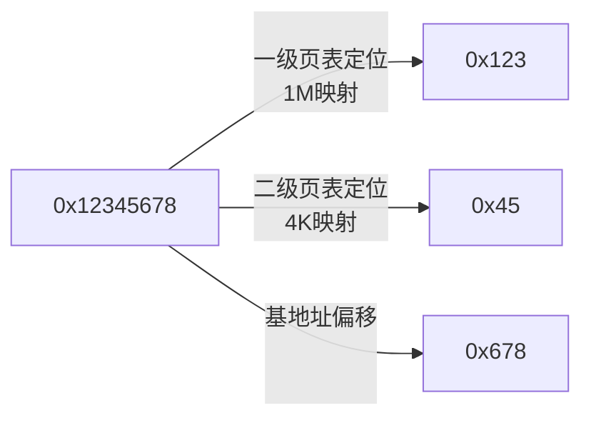
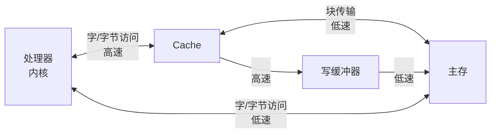

## 数据结构
#### 环形缓冲区(读完即丢)

算法描述(假设缓冲区大小为4)

```shell
		R=0
		||
		\/
buf[0]->[0][1][2][3]
        ||
        \/
		W=0
1、空, R==W
2、写, buf[W]=val, W = (W+1)%4; //到尽头就重新来
3、读, buf[R]=val, R = (R+1)%4; //到尽头就重新来
4、满, (W+1)%4 == R
```

编程

```c
#define len 4
int buf[len];
static int r = 0;
static int w = 0;
static int is_empty(void)
{
	return (r == w);
}
static int is_full(void)
{
	return ((w + 1) % len == r);
}
static void put(int x)
{
	if (is_full()) {
		r = (r + 1) % len; //如果满了还要写，就丢一个
	}
	buf[w] = x;
	w = (w + 1) % len;
}
static int get(int* p)
{
	if (is_empty) {
		return 0;
	}
	*p = buf[r];
	r = (r + 1) % len;
	
	return 1;
} 
```

#### 容器

```c
#define container_of(ptr, type, member) ({					\
	const typeof( ((type *)0)->member ) *__mptr = (ptr);	\		/* 为了编译器检查类型 */
	(type *)( (char*)__mptr - offsetof(type, member) );})

#define offsetof(TYPE, MEMBER)	((size_t)&((TYPE *)0)->MEMBER)
```

#### 内核链表

* 内核链表采用了内嵌的设计理念，省去了大量重复的代码，使用时只需要调用容器，即可得到链表所对的结构体。

```c
/* 操作链表 */
#define LIST_HEAD(name);	// 返回名为name的list_head结构体，并将next,prev指针指向自己，即初始化
#define list_entry(ptr, type, member);// 返回父结构体
list_add(struct list_head *new, struct list_head *head);	// 向后插入节点
list_add_tail(struct list_head *new, struct list_head *head);	// 添加到链表尾部
list_del(struct list_head *entry);	// 删除节点，一般删除之后，还需要下面的操作
list_del_init(struct list_head *entry);	// 让被删掉的节点不乱指
list_move(struct list_head *list, struct list_head *head);	// 把节点从一个链表移动到另一个链表head节点后面
list_move_tail(struct list_head *list, struct list_head *head);	// 把节点从一个链表移动到另一个链表尾部
list_empty(const struct list_head *head);
list_splice(const struct list_head *list, struct list_head *head);	// 合并两个链表
list_splice_init(struct list_head *list, struct list_head *head);	// 合并两个链表并将list指向的链表初始化
/* 遍历链表 */
// 直接遍历链表项
struct list_head *p;
struct foo *f;
list_for_each(p, &foolist) {
    foo = list_entry(p, struct foo, list_membername);
}
// 直接遍历父对象
struct foo *f;
list_for_each_entry(f, &foolist, list_membername) {
    
}
// 反向则加_reverse后缀
/* 遍历时删除，反向同理 */
list_for_each_entry_safe(pos, next, head, member);	//pos和next为同一类型，均为父对象类型
```

#### 内核队列

```c
struct kfifo fifo;
kfifo_alloc(&fifo, size, GFP_KERNEL);	/* return 0 means success */
#define	kfifo_in(fifo, buf, n);	/* return enqueue len, n is sizeof buf */
#define	kfifo_out(fifo, buf, n);	/* return dequeue len */
#define	kfifo_out_peek(fifo, buf, n);	/* just peek, not dequeue */
/* 获取长度 */
#define kfifo_size(fifo);	//返回fifo总长度
#define kfifo_len(fifo);	//返回fifo中已有数据的长度
#define	kfifo_avail(fifo);	//返回剩余空间
#define	kfifo_is_full(fifo);
#define	kfifo_is_empty(fifo);
#define kfifo_reset(fifo);	//重置
#define kfifo_free(fifo);	//释放
```


## Arm Linux内存管理

#### 1. Arm LInux内存分区

* Linux以页为内存管理基本单元，以PAGESIZE定义，一般为0x1000，即4k

* 内存空间分为用户空间和内核空间，用户空间分布一般为0-3GB(PAGE_OFFSET)，以0xc0000000为分界，内核空间的虚拟地址被所有进程所共享


* 应用程序地址空间细分


#### 2. MMU二级页表映射关系



#### 3. cache数据传输机制



根据是否使用**Cache**和**写缓冲器**可产生四种写数据的组合。

| enable Cache? | enable Write Buffer? | Explain                         |
| ------------- | -------------------- | ------------------------------- |
| 0             | 0                    | Non-cached, non-buffered (NCNB) |
| 0             | 1                    | write-combine(WC)               |
| 1             | 0                    | Cached, write-through mode (WT) |
| 1             | 1                    | Cached, write-back mode (WB)    |

方式1：读写直达硬件，适合寄存器的读写。

方式2：读写经写缓冲器写入内存，可能会发生写合并现象，适合显存等不需要读的操作。

方式3：适合于只读设备。

方式4：适合于一般的内存读写。

* 禁用Cache的场合：**Register**、**FrameBuffer**、**DMA**等需要数据一直是同步的情况。

