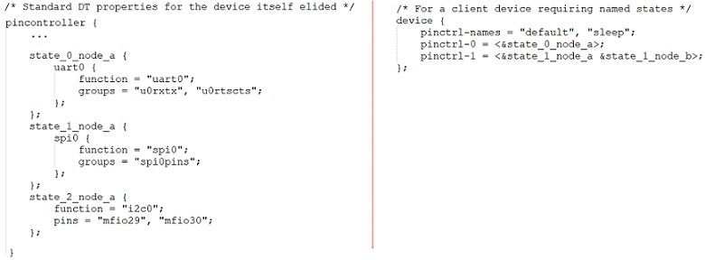
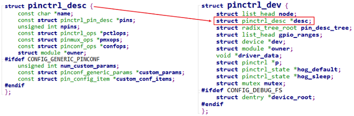
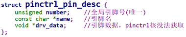
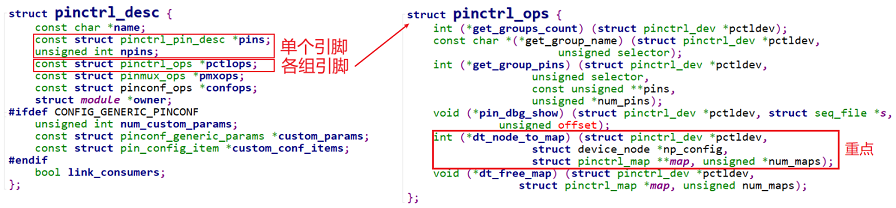
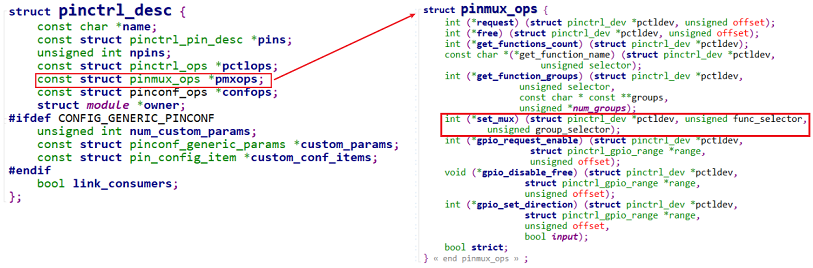
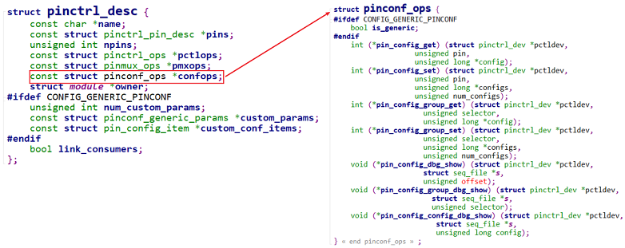
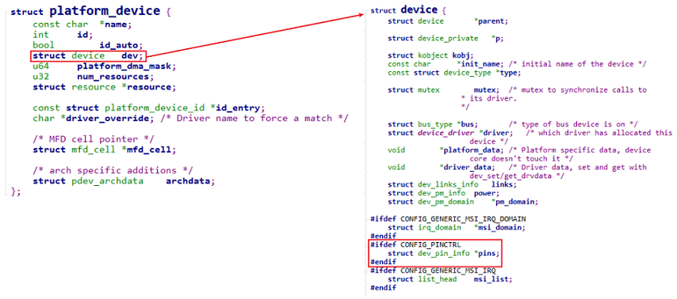
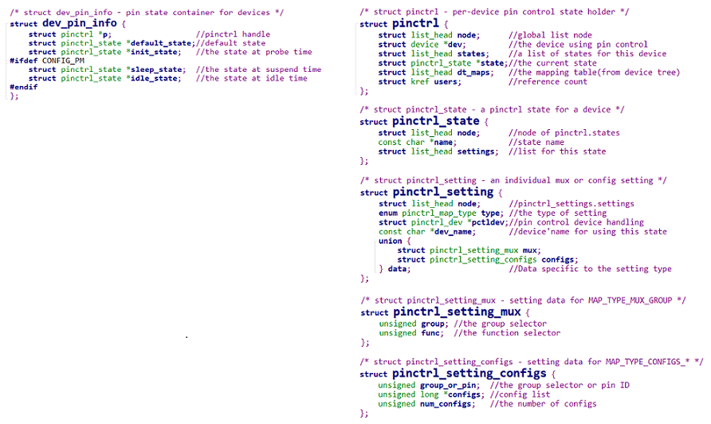
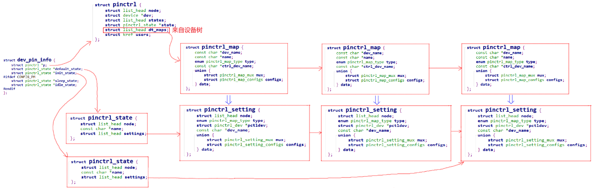

# 一、Pinctrl子系统框架结构

### 1. 设备树


### 2. pincontroller的数据结构

pinctrl的三大作用

*  引脚枚举与命名(Enumerating and naming)
* 引脚复用(Multiplexing)：比如用作GPIO、I2C或其他功能
* 引脚配置(Configuration)：比如上拉、下拉、open drain、驱动强度等

#### 2.1 pinctrl_desc和pinctrl_dev

##### 1. 结构体引入

pincontroller虽然是一个软件的概念，但是它背后是有硬件支持的，所以可以使用一个结构体来表示它：pinctrl_dev。

怎么构造出pinctrl_dev？我们只需要描述它：提供一个pinctrl_desc，然后调用pinctrl_register就可以：

```c
struct pinctrl_dev *pinctrl_register(struct pinctrl_desc *pctldesc,
				    struct device *dev, void *driver_data);
```

怎么使用pinctrl_desc、pinctrl_dev来描述一个pin controller？这两个结构体定义如下：




##### 2. 作用1：描述、获得引脚

使用结构体pinctrl_pin_desc来描述一个引脚，一个pin controller有多个引脚：



使用pinctrl_ops来操作引脚，主要功能有二：

* 来取出某组的引脚：get_groups_count、get_group_pins
* 处理设备树中pin controller中的某个节点：dt_node_to_map，把device_node转换为一系列的pinctrl_map



##### 3. 作用2：引脚复用



##### 4. 作用3：引脚配置



##### 5. 使用pinctrl_desc注册得到pinctrl_dev

调用devm_pinctrl_register或pinctrl_register，就可以根据pinctrl_desc构造出pinctrl_dev，并且把pinctrl_dev放入链表：

```c
devm_pinctrl_register
    pinctrl_register
    	struct pinctrl_dev *pctldev;
		pctldev = kzalloc(sizeof(*pctldev), GFP_KERNEL);	//<==
		pctldev->owner = pctldesc->owner;
		pctldev->desc = pctldesc;
		pctldev->driver_data = driver_data;
		/* check core ops for sanity */
		ret = pinctrl_check_ops(pctldev);
		/* If we're implementing pinmuxing, check the ops for sanity */
		ret = pinmux_check_ops(pctldev);
		/* If we're implementing pinconfig, check the ops for sanity */
		ret = pinconf_check_ops(pctldev);
		/* Register all the pins */
		ret = pinctrl_register_pins(pctldev, pctldesc->pins, pctldesc->npins);
		list_add_tail(&pctldev->node, &pinctrldev_list);	//<==
```

### 3. client的数据结构

在设备树中，使用pinctrl时格式如下：
设备节点要么被转换为platform_device，或者其他结构体(比如i2c_client)，但是里面都会有一个device结构体，比如：



#### 3.1 dev_pin_info

每个device结构体里都有一个dev_pin_info结构体，用来保存设备的pinctrl信息：



#### 3.2 从设备树到setting的映射



### 4. 调用过程

#### 4.1 设备树到setting

```c
really_probe
	pinctrl_bind_pins
		dev->pins = devm_kzalloc(dev, sizeof(*(dev->pins)), GFP_KERNEL);
		
		dev->pins->p = devm_pinctrl_get(dev);
							pinctrl_get
								create_pinctrl(dev);
									ret = pinctrl_dt_to_map(p);	//<==
									
                                    for_each_maps(maps_node, i, map) {
	                                    ret = add_setting(p, map);	//<==map > setting
                                    }
		
		dev->pins->default_state = pinctrl_lookup_state(dev->pins->p,
					PINCTRL_STATE_DEFAULT);			
```

#### 4.2 调用set_mux和config_set

```c
really_probe	//<==
	pinctrl_bind_pins	//<==
		pinctrl_select_state	//<==
			/* Apply all the settings for the new state */
			list_for_each_entry(setting, &state->settings, node) {
				switch (setting->type) {
				case PIN_MAP_TYPE_MUX_GROUP:
					ret = pinmux_enable_setting(setting);
							ret = ops->set_mux(...);	//<==
				break;
				case PIN_MAP_TYPE_CONFIGS_PIN:
				case PIN_MAP_TYPE_CONFIGS_GROUP:
					ret = pinconf_apply_setting(setting);
							ret = ops->pin_config_group_set(...);	//<==
					break;
				default:
					ret = -EINVAL;
				break;
			}		
```

# 二、虚拟Pinctrl驱动

### 1. 硬件功能

假设这个虚拟的pin controller有4个引脚：

* pin0,1,2,3都可以配置为GPIO功能
* pin0,1还可以配置为I2C功能
* pin2,3还可以配置为UART功能

### 2. 编写设备树文件

```shell
virtual_pincontroller {
	compatible = "chipx,virtual_pinctrl";
	i2cgrp: i2cgrp {
			functions = "i2c", "i2c";
			groups = "pin0", "pin1";
			configs = <0x11223344  0x55667788>;
	};
};
virtual_i2c {
	compatible = "chipx,virtual_i2c";
	pinctrl-names = "default";
	pinctrl-0 = <&i2cgrp>;
};
```

### 3. 编写Pinctrl驱动程序

* 分配pinctrl_desc结构体

* 设置pinctrl_desc结构体

* 注册pinctrl_desc结构体

**示例代码** [virtual_pinctrl_driver.c](code\pinctrl\virtual_pinctrl_driver.c) 

# 三、Pinctrl子系统的sysfs接口
linux系统的`/sys/kernel/debug/pinctrl/`目录下，每一个pin controller都有一个目录，比如virtual_pincontroller。
里面有很多文件，作用如下：

| Pinctrl的虚拟文件 | 作用                                                         | 解释 |
| ----------------- | ------------------------------------------------------------ | ---- |
| pins              | 单个引脚信息                                                 |      |
| pingroups         | 引脚的组信息                                                 |      |
| pinmux-pins       | 单个引脚的复用信息                                           |      |
| pinmux-functions  | function下的group(支持该function的group)                     |      |
| pinconf-pins      | 单个引脚的配置                                               |      |
| pinconf-groups    | 引脚组的配置                                                 |      |
| pinconf-config    | 可以通过写它修改指定设备、指定状态下、指定(组)引脚的config值 |      |
* 单个引脚信息
  ```shell
  cat /sys/kernel/debug/pinctrl/virtual_pincontroller/pins
  registered pins: 4
  pin 0 (pin0) virtual_pincontroller
  pin 1 (pin1) virtual_pincontroller
  pin 2 (pin2) virtual_pincontroller
  pin 3 (pin3) virtual_pincontroller
  ```
* 引脚的组信息
  ```shell
  cat /sys/kernel/debug/pinctrl/virtual_pincontroller/pingroups
  registered pin groups:
  group: pin0
  pin 0 (pin0)
  group: pin1
  pin 1 (pin1)
  group: pin2
  pin 2 (pin2)
  group: pin3
  pin 3 (pin3)
  ```
* 单个引脚的复用信息
  ```shell
  cat /sys/kernel/debug/pinctrl/virtual_pincontroller/pinmux-pins
  Pinmux settings per pin
  Format: pin (name): mux_owner gpio_owner hog?
  pin 0 (pin0): virtual_i2c (GPIO UNCLAIMED) function i2c group pin0
  pin 1 (pin1): virtual_i2c (GPIO UNCLAIMED) function i2c group pin1
  pin 2 (pin2): (MUX UNCLAIMED) (GPIO UNCLAIMED)
  pin 3 (pin3): (MUX UNCLAIMED) (GPIO UNCLAIMED)
  ```
* function下的group(支持该function的group)
  ```shell
  cat /sys/kernel/debug/pinctrl/virtual_pincontroller/pinmux-functions
  function: gpio, groups = [ pin0 pin1 pin2 pin3 ]
  function: i2c, groups = [ pin0 pin1 ]
  function: uart, groups = [ pin2 pin3 ]
  ```
* 单个引脚的配置
  ```shell
  cat /sys/kernel/debug/pinctrl/virtual_pincontroller/pinconf-pins
  Pin config settings per pin
  Format: pin (name): configs
  pin 0 (pin0): 0x11223344
  pin 1 (pin1): 0x55667788
  pin 2 (pin2): 0x0
  pin 3 (pin3): 0x0
  ```
* 引脚组的配置
  ```shell
  cat /sys/kernel/debug/pinctrl/virtual_pincontroller/pinconf-groups
  Pin config settings per pin group
  Format: group (name): configs
  0 (pin0): 0x11223344
  1 (pin1): 0x55667788
  2 (pin2): 0x0
  3 (pin3): 0x0
  ```
* 修改配置值
  内核源码：
  ```c
  drivers\pinctrl\pinconf.c
      pinconf_dbg_config_write
  ```
  如果pin controller驱动程序中的pinconf_ops提供了pin_config_dbg_parse_modify函数，
  就可以通过`pinconf-config`文件修改某个pin或某个group的配置值。
  ```shell
  // 格式: modify <config> <devicename> <state> <pin_name|group_name> <newvalue>
  echo "modify config_pin virtual_i2c default pin0 0xaabb" > /sys/kernel/debug/pinctrl/virtual_pincontroller/pinconf-config
  cat /sys/kernel/debug/pinctrl/virtual_pincontroller/pinconf-config
  ```

