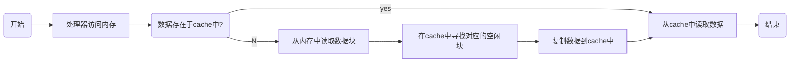

#### cpu

* PC始终保存下一条CPU要执行的指令地址
* LIFO Last Input First Output，栈
* 处理器对外设IO分为内存映射IO空间和独立IO空间
* 处理器上电后，PC寄存器固化了一个默认值
* bootloader一般分为三个阶段
  * BL0-固化于硬件中，用于初始化硬件，加载并运行BL1
  * BL1-存储于外部存储设备中，用于初始化主存，加载并运行BL2
  * BL2-存储于外部存储设备中，用于引导操作系统执行

#### 中断

* 中断处理之后，一般处理器和外设的状态标记都要清除
* 程序断点的实现原理
  * 获取原程序指定行对应的代码地址
  * 把代码地址中的指令替换为中断触发指令
  * 在中断服务程序中将控制权交给调试程序
  * 调试程序读写原程序上下文信息
  * 调试程序将代码地址中的指令还原
  * 原程序从断点处继续向下执行
  

#### 内存

* 页式内存管理法

  * 页式内存管理法将内存分为两个部分p,d

    * p-地址高位，页面号

    * d-地址低位，页内偏移量

* 给定虚拟地址查询页映射表查询不成功，则查看物理内存是否充足，若充足则将目标页面换入物理内存，更新页映射表，若不充足，则置换物理内存中的闲置页面，更新页映射表，重复以上操作。
* 每一个页面都有一个属性，MMU通过属性值，来起到内存保护的作用。

#### 缓存

* 由于时间局部性以及空间局部性，引入了一个读取速度几乎与处理器运算速度几乎同数量级的小容量高速存储器，即Cache。
* 把内存中被频繁访问的指令和数据复制到cache中



* 内存和cache之间如何映射-直接映射法

  将cache和内存分成固定大小的块，内存中每一块在cache中都有固定的映射位置，映射公式为pos = 内存块号 % cache总块数

  * 地址划分

  ```shell
  ____________________________
  | 标记 | cache块号 | 块内地址 |
  ----------------------------
   ||        ||         ||
   \/        \/         \/
   t位       c位        b位
  ```

  根据访问地址中间的c位找到cache中的对应块

  比较地址的高t位是否和flag相同

  若相同，直接读取数据

  若不同，从内存中复制块内容

  举例

  ```shell
  #内存地址0x0240c对应二进制划分
  _________________________________
  | 0000 001 | 0010 | 0 0000 1100 |
  ---------------------------------
  先访问cache中的第0010块，然后匹配该块的标记部分是否与0000 001，从而确定内存在cache中。
  ```

  直接映射法由于有一对多的情况，若每次都访问同一块cache，就会造成缓存失效。

* 缓存的设计理念可以应用于任意有空间局部性的操作中，进行代码优化。

#### 嵌入式c语言编辑器

* GCC GNU Compiler Collection是一个集合，而gcc特指gcc中的c语言编译器。
* gcc -WI,-Map=test.map test.c，用于查找全局变量、函数等被编译器分配的内存地址(虚存)
* gcc -D'TEST="test" file`， 用于定义宏
* gcc -v file.c，获取系统头文件的路径
* gcc -M test.c，获取目标文件的依赖
* gcc -MM test.c，获取部分依赖(自己的头文件)
* gcc -L以gcc- l，大小写，大写代表一个路径，小写代表具体文件，其中库文件可以不写前缀lib和后缀
* ar crs <libfile.a> <file.o>，打包成库文件
* gcc -g，添加调试信息

#### 开发中的辅助工具

| 工具名(Binutils) | 功能简介                       |
| ---------------- | ------------------------------ |
| addr2line        | 将代码地址转换为对应的程序行号 |
| strip            | 剔除可执行程序中的调试信息     |
| ar               | 将目标文件打包成为静态库       |
| nm               | 列出目标文件中的符号及对应地址 |
| objdump          | 查看程序段信息及反汇编         |
| size             | 查看目标文件中的段大小         |
| strings          | 查看目标文件中的字符串         |

* addr2line

将指定地址转换为对应的文件名和行号，常用于分析和定位内存访问错误的问题。

1. 开启core dump选项

`ulimit -c unlimited`

2. 运行程序，并生成崩溃时的core文件
3. 读取core文件，获取IP寄存器的值(0x08048000)

`dmesg | tail`

4. 使用addr2line 定位代码行

`addr2line <addr> -f -e <file.out>`

5. `strip <file.out>`，剔除调试信息

* ar

`ar crs libname.a x.o y.o`，打包

`ar x libname.a`，解压

* nm

`nm <file>`

```shell
08048430			T				func
   ||				||				 ||
   \/				\/			     \/
标识符对应地址	      标识符位于代码段    标识符的名字
```

| 段标识 | 说明                                   |
| ------ | -------------------------------------- |
| A      | 地址值在链接过程中不会发生改变         |
| B或b   | 标识符位于未初始化数据段(.bss)         |
| C      | 未定义存储段的标识符，链接时决定段位置 |
| D或d   | 标识符位于数据段(.data)                |
| N      | 调试专用标识符                         |
| R或r   | 标识符位于只读存储区(.rdata)           |
| T或t   | 标识符位于代码段(.text)                |
| U      | 未定义的标识符                         |

* objdump

`objdump -d func.o`，只打印汇编代码

`objdump -S func.o`，连同c函数的关系都要打印

`objdump -h test.out`，查看目标文件的段信息

`objdump -s -j <section_name>` 查看段的信息

| 标识      | 说明                     |
| --------- | ------------------------ |
| Idx       | 段下标                   |
| Name      | 段标识符                 |
| Size      | 段所占空间的大小         |
| VMA(终点) | 段起始位置的虚存地址     |
| LMA(起点) | 段在存储空间中的加载地址 |
| File off  | 段在目标文件中的相对位置 |
| Algn      | 段的边界对齐字节数       |

* `size <filename>`，列出目标文件所有段的大小
* `strings <filename>`，列出目标文件中所有字符串常量

#### 揭开链接器的面纱

`mian()`不是第一个运行的函数，加载后，`_start()`是第一个被调用运行的函数，该函数准备好参数后立即调用`__libc_start_main()`函数，该函数初始化运行环境后再调用`main()`函数。`_start()`是.text段的起始地址。

`__libc_start_main()`函数的作用

1. 调用`__libc_csu_init()`函数，完成必要的初始化操作
2. 调用程序的第一个线程，即主线程，`main()`为线程入口
3. 注册`__libc_csu_fini()`函数，程序运行终止时被调用


* -e可以在链接时指定入口函数

`gcc -e <func> -nostartfiles <.o> -o <.out>`

* 链接脚本

合并各个目标文件中的段，重定位各个段的起始地址，重定位各个符号的最终地址。

```lds
SECTIONS	=>关键字，描述各个段在内存中的布局
{
    .text 0x2000000:	=>代码段的起始地址
    {
    	*(.text)		=>所有目标文件中的代码段合并进入可执行程序
    }
    . = 0x8000000;		=>设置当前地址
    S = .;				=>设置标识符S的存储地址
    .data 0x3000000:
    {
    	*(.data)
    }
    .bss :				=>如果没指定值，则会根据默认的规范，给出一个默认值
    {
    	*(.bss)
    }
}
```

注意事项

1. 各个段的链接地址必须符合具体平台的规范
2. 链接脚本中能够直接定义标识符并指定存储地址
3. 链接脚本中能够指定源代码中标识符的存储地址
4. 在Linux中，进程代码段(.text)的合法起始地址为[0x08048000, 0x08049000]
5. 可在链接脚本中分配变量，并用extern在c程序中使用

```lds
MEMORY
{
	RAM0 (WX) : ORIGIN = 0x02000000, LENGTH = 1024k
	RAM1 (!X) : ORIGIN = 0x04000000, LENGTH = 256k
}
SECTIONS
{
	.text : { *(.text) } > RAM0
	.data : { *(.data) } > RAM1
	.bss : { *(.bss) } > RAM1
}
```

| 标识 | 说明     |
| ---- | -------- |
| R    | 只读     |
| W    | 可读可写 |
| X    | 可执行   |
| A    | 可分配   |
| I    | 已初始化 |
| L    | 已初始化 |
| !    | 属性反转 |

* `ENTRY(entry)`定义入口点

* `ld --verbose > default.lds`默认的链接脚本

```lds
ENTRY(program)

SECTIONS
{
    .text 0x08048000 + SIZEOF_HEADERS :	<=应用程序头偏移
    {
        *(.text)
        *(.rodata)
    }

    /DISCARD/ :	<=整段表示弃用除已定义外的段
    {
        *(*)
    }
}

```

* `ld -static`使用静态链接的方式生成最终程序
* `gcc -fno-builtin`用于关闭GCC内置函数的功能

```makefile
CC := gcc
LD := ld
RM := rm -rf

TARGET := test.out
SRC := $(TARGET:.out=.c)
OBJ := $(TARGET:.out=.o)
LDS := $(TARGET:.out=.lds)

.PHONY : rebuild clean all
$(TARGET) : $(OBJ) $(LDS)
    $(LD) -static -T $(LDS) -o $@ $< -m elf_i386
    @echo "Target File ==> $@"

$(OBJ) : $(SRC)
    $(CC) -fno-builtin -o $@ -c $^ -m32

rebuild : clean all

all : $(TARGET)

clean :
    $(RM) $(TARGET) $(OBJ)

```


#### 汇编语言的嵌入式编程

```c
asm volatile(			//volatile optional
	"汇编指令，用\n分隔"
    :"=限制符"(输出参数)	//optional
    :"限制符"(输入参数)	//optional
    :保留列表			  //optional
);
int result = 0;
int input = 1;
asm volatile (
	"movl %1, %0\n"
    : "=r"(result)		//r代表编译器自动关联合适的通用寄存器
    : "r"(input));
```

| 限制符 | 说明                     |
| ------ | ------------------------ |
| r      | 通用寄存器               |
| a      | eax,ax,al                |
| b      | ebx,bx,bl                |
| c      | ecx,cx,cl                |
| d      | edx,dx,dl                |
| S      | esi,si                   |
| D      | edi,di                   |
| q      | 寄存器abcd               |
| m      | 使用合法内存代表参数     |
| g      | 任意寄存器，内存，立即数 |

```c
asm volatile (                                                                           
    "movl %%eax, %%ecx\n"                                                           
    "movl %%ebx, %%eax\n"                                                           
    "movl %%ecx, %%ebx\n"                                                           
    : "=a"(a), "=b"(b)   	//操作a寄存器等于操作a变量，操作b寄存器等于操作b变量
    : "a"(a), "b"(b)                                                               
);
```

* 不用printf输出打印

```c
char* s = "Hello world\n";
int l = 12;
asm volatile (
	"movl $4, %%eax\n"	//指定编号为4的系统调用(sys_write)
    "movl $1, %%ebx\n"	//指定sys_write的输出目标，1为标准输出
    "movl %0, %%ecx\n"	//指定输出字符串地址
    "movl %1, %%edx\n"	//指定输出字符串长度
    "int $0x80	   \n"	//执行系统调用
    :
    : "r"(s), "r"(l)
    : "eax", "ebx", "ecx", "edx");	//保留寄存器，不要去关联任何变量
);
asm volatile (
	"movl $1, %eax\n"	//指定编号为1的系统调用(sys_exit)//没有可选参数，就一个%就行
    "movl $42, %ebx\n"	//指定sys_exit的参数，即退出码
    "int $0x80	    \n"	//执行系统调用
);
```

* `echo $?`打印上一个进程的退出码

#### GDB

* 直接启动
  * `gdb`
  * `gdb test.out`
  * `gdb test.out core`
* 动态连接
  * `gdb test.out pid`

```shell
$ gdb
file <file.out>
set args <arg1> ... <argn>
run
```

```shell
$ gdb
attach <pid>	#一般绑定会暂停进程，因此需要敲一下继续
continue
```

* 断点类型（只有ram中运行的才能用软件断点，flash上的不可以）
  * 软件断点：由非法指令异常实现（软件实现）
  * 硬件断点：由硬件特性实现（数量有限）
  * 数据断点：由硬件特性实现（数量有限）

| 命令                                                         | 说明                                                         |
| ------------------------------------------------------------ | ------------------------------------------------------------ |
| `file <filename>`                                            | 设置启动文件                                                 |
| `set args <arg1> ...[argn]`                                  | 设置启动参数                                                 |
| `start`                                                      | 启动并暂停                                                   |
| `run`                                                        | 执行                                                         |
| `continue`                                                   | 继续执行到断点                                               |
| `attach <pid>`                                               | 绑定具体线程                                                 |
| `break/tbreak <func_name> [if var = value]`                  | 函数打断点，带t一次性                                        |
| `break/tbreak <file_name>:<line_num> [if var = value]`       | 文件行号打断点                                               |
| `info breakpoints`                                           | 查看断点                                                     |
| `delete 1 2 n / delete breakpoints`                          | 删除断点                                                     |
| `enable/disable 1 2 n  / breakpointes`                       | 改变断点状态                                                 |
| `print [/a] name`                                            | 变量查看                                                     |
| `set var name=value`                                         | 变量设置                                                     |
| `next / next n`                                              | 执行下一行代码/n行代码                                       |
| `step`                                                       | 执行进入函数                                                 |
| `return [value]`                                             | 强制当前函数返回                                             |
| `finish`                                                     | 运行至当前函数返回                                           |
| `until <line>`                                               | 执行至目标行                                                 |
| `jump <line>`                                                | 跳转执行                                                     |
| `hbreak`                                                     | 硬件断点                                                     |
| `show can-use-hw-watchpoints`                                | 查看支持多少硬件断点                                         |
| `watch <var_name>`                                           | 数据断点                                                     |
| `x /Nuf <expression>`<br />e.g. `x /4bx 0x804a024`<br />16进制，连续4byte，内存单元查看(b h w g)(x d u o t(bin) a(address) c f） | N-需要打印的单元数<br />u-每个单元的大小<br />f-数据打印的格式 |
| `backtrace`                                                  | 查看函数调用(栈)的顺序                                       |
| `frame N`                                                    | 切换到栈编号为N的上下文中                                    |
| `info frame`                                                 | 查看当前函数调用的栈帧信息                                   |
| `info registers`                                             | 查看当前寄存器的值                                           |
| `info args`                                                  | 查看当前函数参数的值                                         |
| `info locals`                                                | 查看当前局部变量的值                                         |
| `info variables`                                             | 查看程序中变量符号                                           |
| `info functions`                                             | 查看程序中函数符号                                           |
| `display /format <experssion> & undisplay `                  |                                                              |
| `whatis/ptype`                                               | 查看程序中的符号，后者更细                                   |
| `list & set listsize N`                                      | GDB代码查看                                                  |
| `shell <nomarl shell cmd>`                                   | GDB的Shell操作                                               |

* 多线程程序，要加`-pthread`

#### 深入理解程序的结构

* 代码段(.text)
  * 源代码中的可执行语句编译后进入代码段
  * 代码段在有内存管理单元的系统中具有只读属性
  * 代码段的大小在编译结束后就已经固定（不能动态改变）
  * 代码段中可以包含常量数据（如：常量字符串）
* 数据段（.data，.bss，.rodata）用于存放具有全局生命期的变量
  * .bss，存储未初始化（初始化为0）的变量
  * .data，存储具有非0初始值的变量
  * .rodata，存储const关键字修饰的变量
* 栈的用途
  * 中断发生时，栈用于保存寄存器的值
  * 函数调用时，栈用于保存函数中的活动记录（栈帧信息）
  * 并发编程时，每个线程拥有自己独立的栈

* 内存映射段（Memory Mapping Segment）
  * 内核将硬盘文件的内容直接映射到内存映射段（mmap）
  * 动态链接库在可执行程序加载时映射到内存映射段
  * 程序执行时能够创建匿名映射区存放程序数据
* 内存映射文件原理
  * 将硬盘上的文件数据**逻辑映射**到内存中（零耗时）
  * 通过**缺页中断**进行文件数据的实际载入（一次数据拷贝）
  * 映射后的内存的读写就是对文件数据的读写

#### 缔造程序兼容的合约

* ABI（Application Binary Interface）应用程序二进制接口
  * 数据类型的大小、数据对齐方式
  * 函数调用时发生的调用约定
  * 系统调用的编号，以及进行系统调用的方式
  * 目标文件的二进制格式、程序库格式等

* EABI（Embedded）
  * 可链接目标代码以及可执行文件格式的二进制规范
  * 编译链接工具的基础规范、函数调用规范、调试格式规范等
  * EABI与ABI的主要区别是应用程序代码中允许使用特权指令
* ABI定义了函数调用时
  * 栈帧的内存布局
  * 栈帧的形成方式
  * 栈帧的摧毁方式
