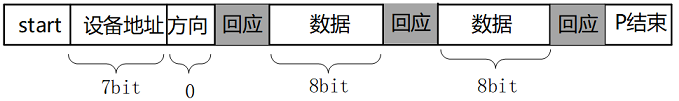
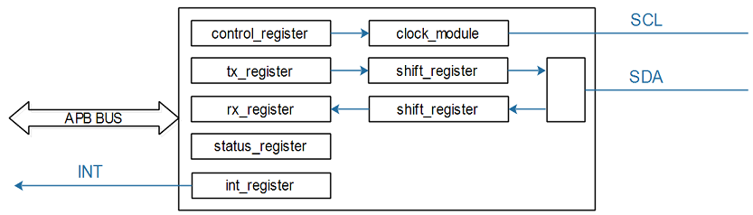
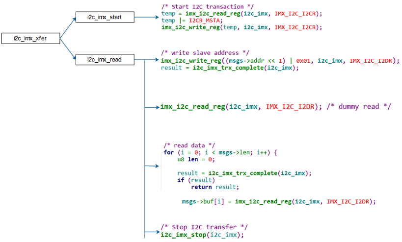

参考资料

* Documentation\i2c\instantiating-devices.rst
* Documentation\i2c\writing-clients.rst
* Linux-4.9.88\drivers\i2c\busses\i2c-imx.c

## 1. I2C协议(白主灰从)

#### 1.1 写操作



#### 1.2 读操作


#### 1.3 概念补充

* 从设备可以拉低CLK，可以一直占用该I2C总线
* SDA、SCL都必须开漏接上拉，以保证不会短路
* 开始信号是低跳变，结束信号是高跳变，应答信号是8位数据后的拉低(I2C不强制有ACK)

## 2. SMBus协议(白主灰从)

#### 2.1 与I2C的差别

* 电压范围受限，1.8V-5V
* 最小频率受限10KHz且，Clock Stretching也有限制
* 必须有ACK
* 在读写之间可以没有P信号
* 优先使用SMBus

#### 2.2 新的传输格式

| Functionality flag              | Data protocol       | Description                 |
| ------------------------------- | ------------------- | --------------------------- |
| I2C_FUNC_SMBUS_QUICK            | SMBus Quick Command | 读写位当控制信号            |
| I2C_FUNC_SMBUS_READ_BYTE        | SMBus Receive Byte  | 中间无P信号，数据后可无ACK  |
| I2C_FUNC_SMBUS_WRITE_BYTE       | SMBus Send Byte     | 中间无P信号                 |
| I2C_FUNC_SMBUS_READ_BYTE_DATA   | SMBus Read Byte     | 与2比加了外设芯片寄存器地址 |
| I2C_FUNC_SMBUS_READ_WORD_DATA   | SMBus Read Word     | 读字                        |
| I2C_FUNC_SMBUS_WRITE_BYTE_DATA  | SMBus Write Byte    | 与3比加了外设芯片寄存器地址 |
| I2C_FUNC_SMBUS_WRITE_WORD_DATA  | SMBus Write Word    | 写字                        |
| I2C_FUNC_SMBUS_READ_BLOCK_DATA  | SMBus Block Read    | 指定块大小                  |
| I2C_FUNC_SMBUS_WRITE_BLOCK_DATA | SMBus Block Write   | 指定块大小                  |

## 3. I2C系统的重要结构体

APP通过i2c_adapter与i2c_client传输数据，中间媒介是i2c_msg。

**i2c_adapter ** 重要成员

* nr：第几个I2C BUS(I2C Controller)

* i2c_algorithm，里面有该I2C BUS的传输函数(master_xfer)，用来收发I2C数据

**i2c_client**  重要成员

* 设备地址addr
* i2c_adapter是什么adapter

**i2c_msg(i2c_algorithm结构体里)** 重要成员

* i2c_msg中的flags用来表示传输方向：bit 0等于I2C_M_RD表示读，bit 0等于0表示写

* 举例：设备地址为0x50的EEPROM，要读取它里面存储地址为0x10的一个字节，要构造2个i2c_msg

  ```c
  u8 data_addr = 0x10;
  i8 data;
  struct i2c_msg msgs[2];
  msgs[0].addr   = 0x50;	//写操作，把要访问的存储地址0x10发给设备
  msgs[0].flags  = 0;
  msgs[0].len    = 1;
  msgs[0].buf    = &data_addr;
  
  msgs[1].addr   = 0x50;	//读操作
  msgs[1].flags  = I2C_M_RD;
  msgs[1].len    = 1;
  msgs[1].buf    = &data;
  ```

## 4. I2C-Tools

#### 4.1i2cdetect：I2C检测

```shell
#列出当前的I2C Adapter(或称为I2C Bus、I2C Controller)
$ i2cdetect -l
#打印某个I2C Adapter的Functionalities, I2CBUS为0、1、2等整数
$ i2cdetect -F I2CBUS
#看看有哪些I2C设备, I2CBUS为0、1、2等整数
$ i2cdetect -y -a I2CBUS
```

#### 4.2 i2cget：SMBus读  

```shell
#读一个字节: I2CBUS为0、1、2等整数, 表示I2C Bus; CHIP-ADDRESS表示设备地址
$ i2cget -f -y I2CBUS CHIP-ADDRESS
#读某个地址上的一个字节: 
#MODE：有2个取值, b-使用`SMBus Read Byte`先发出DATA-ADDRESS, 再读一个字节, 中间无P信号
#               c-先write byte, 在read byte，中间有P信号 
$ i2cget -f -y I2CBUS CHIP-ADDRESS DATA-ADDRESS MODE  
#读某个地址上的2个字节: 
$ i2cget -f -y I2CBUS CHIP-ADDRESS DATA-ADDRESS w 
```

#### 4.3 i2cset：SMBus写

```shell
#写一个字节: I2CBUS为0、1、2等整数, 表示I2C Bus; CHIP-ADDRESS表示设备地址,DATA-ADDRESS就是要写的数据
$ i2cset -f -y I2CBUS CHIP-ADDRESS DATA-ADDRESS  
#给address写1个字节(address, value):
$ i2cset -f -y I2CBUS CHIP-ADDRESS DATA-ADDRESS VALUE
#给address写2个字节(address, value):
$ i2cset -f -y I2CBUS CHIP-ADDRESS DATA-ADDRESS VALUE w 
#I2C Block Write：给address写N个字节的数据
$ i2cset -f -y I2CBUS CHIP-ADDRESS DATA-ADDRESS VALUE1 ... VALUEN i
```

#### 4.4 i2ctransfer(i2c)

  ```shell
  // Example (bus 0, read 8 byte at offset 0x64 from EEPROM at 0x50):
  # i2ctransfer -f -y 0 w1@0x50 0x64 r8
  // Example (bus 0, write 3 byte at offset 0x64 from EEPROM at 0x50):
  # i2ctransfer -f -y 0 w9@0x50 0x64 val1 val2 val3
  // Example 
  // first: (bus 0, write 3 byte at offset 0x64 from EEPROM at 0x50)
  // and then: (bus 0, read 3 byte at offset 0x64 from EEPROM at 0x50)
  # i2ctransfer -f -y 0 w9@0x50 0x64 val1 val2 val3 r3@0x50  
  # i2ctransfer -f -y 0 w9@0x50 0x64 val1 val2 val3 r3 //如果设备地址不变,后面的设备地址可省略
  ```

## 5. I2C系统驱动模型

#### 5.1 i2c_driver

i2c_driver表明能支持哪些设备：

* 使用of_match_table来判断
  * 设备树中，某个I2C控制器节点下可以创建I2C设备的节点
    * 如果I2C设备节点的compatible属性跟of_match_table的某项兼容，则匹配成功
  * i2c_client.name跟某个of_match_table[i].compatible值相同，则匹配成功
* 使用id_table来判断
  * i2c_client.name跟某个id_table[i].name值相同，则匹配成功

i2c_driver跟i2c_client匹配成功后，就调用i2c_driver.probe函数。

#### 5.2 i2c_client

**方法一：设备树**

```c
i2c1: i2c@400a0000 {
	/* ... master properties skipped ... */
	clock-frequency = <100000>;
	flash@50 {
		compatible = "atmel,24c256";
		reg = <0x50>;
	};
};
```

**方法二：函数创建**

* i2c_new_device

```c
static struct i2c_board_info sfe4001_hwmon_info = {
    I2C_BOARD_INFO("max6647", 0x4e),
};
int sfe4001_init(struct efx_nic *efx)
{
    (...)
    efx->board_info.hwmon_client =
        i2c_new_device(&efx->i2c_adap, &sfe4001_hwmon_info);
    (...)
}
```

* i2c_new_probed_device

```c
static const unsigned short normal_i2c[] = { 0x2c, 0x2d, I2C_CLIENT_END };
static int usb_hcd_nxp_probe(struct platform_device *pdev)
{
    (...)
    struct i2c_adapter *i2c_adap;
    struct i2c_board_info i2c_info;
    (...)
    i2c_adap = i2c_get_adapter(2);
    memset(&i2c_info, 0, sizeof(struct i2c_board_info));
    strscpy(i2c_info.type, "isp1301_nxp", sizeof(i2c_info.type));
    isp1301_i2c_client = i2c_new_probed_device(i2c_adap, &i2c_info, normal_i2c, NULL);
    i2c_put_adapter(i2c_adap);
    (...)
}
```

前者设备可以不存在，后者设备必须存在

**方法三：用户空间**

```shell
#创建一个i2c_client, .name = "eeprom", .addr=0x50, .adapter是i2c-3
$ echo eeprom 0x50 > /sys/bus/i2c/devices/i2c-3/new_device
#删除一个i2c_client
$ echo 0x50 > /sys/bus/i2c/devices/i2c-3/delete_device
```

## 6. 设备driver、设备client、Adapt

driver [ap3216c_drv.c](code\i2c\ap3216c_drv.c) ,client [ap3216c_client.c](code\i2c\ap3216c_client.c) ,app [ap3216c_drv_test.c](code\i2c\ap3216c_drv_test.c) 

```c
&i2c1 {
		ap3216c@1e {
			compatible = "lite-on,ap3216c";
			reg = <0x1e>;
		};
};
```

adapt [i2c_adapter_drv.c](code\i2c\i2c_adapter_drv.c) 

```c
/ {
	i2c-bus-virtual {
		 compatible = "100ask,i2c-bus-virtual";
	};
};
```

## 7. 使用i2c-gpio.c

make menuconfig中要开启GPIO-based bitbanging I2C

设置设备数，在里面添加一个节点

* compatible = "i2c-gpio";

* 使用pinctrl把 SDA、SCL所涉及引脚配置为GPIO、开极(可选)

* 指定SDA、SCL所用的GPIO

* 指定频率(2种方法)：

  * i2c-gpio,delay-us = <5>;	/* ~100 kHz，5要*2 */
  * clock-frequency = <400000>;

* #address-cells = <1>;

* #size-cells = <0>;

* i2c-gpio,sda-open-drain：

  * 它表示其他驱动、其他系统已经把SDA设置为open drain了
  * 在驱动里不需要在设置为open drain
  * 如果需要驱动代码自己去设置SDA为open drain，就不要提供这个属性

* i2c-gpio,scl-open-drain：

  * 它表示其他驱动、其他系统已经把SCL设置为open drain了

  * 在驱动里不需要在设置为open drain

  * 如果需要驱动代码自己去设置SCL为open drain，就不要提供这个属性

## 8. 具体芯片的Adapter

#### 8.1 I2C控制器内部简化结构



#### 8.2 I2C控制器操作方法

* 使能时钟、设置时钟
* 发送数据：
  * 把数据写入**tx_register**，等待中断发生
  * 中断发生后，判断状态：是否发生错误、是否得到回应信号(ACK)
  * 把下一个数据写入**tx_register**，等待中断：如此循环
* 接收数据：
  * 设置**controller_register**，进入接收模式，启动接收，等待中断发生
  * 中断发生后，判断状态，读取**rx_register**得到数据
  * 如此循环

#### 8.3 分析代码

设备树

* IMX6ULL:  `arch/arm/boot/dts/imx6ull.dtsi`

  ```shell
  i2c1: i2c@021a0000 {
  		#address-cells = <1>;
  		#size-cells = <0>;
  		compatible = "fsl,imx6ul-i2c", "fsl,imx21-i2c";
  		reg = <0x021a0000 0x4000>;
  		interrupts = <GIC_SPI 36 IRQ_TYPE_LEVEL_HIGH>;
  		clocks = <&clks IMX6UL_CLK_I2C1>;
  		status = "disabled";   // 在100ask_imx6ull-14x14.dts把它改为了"okay"
  };
  ```

* STM32MP157:  `arch/arm/boot/dts/stm32mp151.dtsi`

  ```shell
  i2c1: i2c@40012000 {
  		compatible = "st,stm32mp15-i2c";
  		reg = <0x40012000 0x400>;
  		interrupt-names = "event", "error";
  		interrupts-extended = <&exti 21 IRQ_TYPE_LEVEL_HIGH>,
  							  <&intc GIC_SPI 32 IRQ_TYPE_LEVEL_HIGH>;
  		clocks = <&rcc I2C1_K>;
  		resets = <&rcc I2C1_R>;
  		#address-cells = <1>;
  		#size-cells = <0>;
  		dmas = <&dmamux1 33 0x400 0x80000001>,
  			   <&dmamux1 34 0x400 0x80000001>;
  		dma-names = "rx", "tx";
  		power-domains = <&pd_core>;
  		st,syscfg-fmp = <&syscfg 0x4 0x1>;
  		wakeup-source;
  		status = "disabled";   // 在stm32mp15xx-100ask.dtsi把它改为了"okay"
  };
  ```


驱动程序分析

读I2C数据时，要先发出设备地址，这是写操作，然后再发起读操作，涉及写、读操作。所以以读I2C数据为例讲解核心代码。

* IMX6ULL：函数`i2c_imx_xfer`分析：
  


* STM32MP157：函数`stm32f7_i2c_xfer`分析
  这函数完全有驱动程序来驱动：启动传输后，就等待；在中断服务程序里传输下一个数据，知道传输完毕。
  * 启动传输
    
  
  * 通过中断进行后续传输
    

