## Distributor 寄存器描述

### 1. **Distributor Control Register, GICD_CTLR**

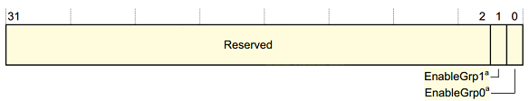

| 位域 | 名         | 读写 | 描述                                                         |
| ---- | ---------- | ---- | ------------------------------------------------------------ |
| 1    | EnableGrp1 | R/W  | 用于将pending Group 1中断从Distributor转发到CPU interfaces  <br>0：group 1中断不转发  1：根据优先级规则转发Group 1中断 |
| 0    | EnableGrp0 | R/W  | 用于将pending Group 0中断从Distributor转发到CPU interfaces  <br>0：group 0中断不转发  1：根据优先级规则转发Group 0中断 |

### 2. **Interrupt Controller Type Register, GICD_TYPER**

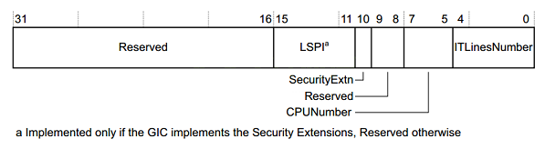

| 位域  | 名            | 读写 | 描述                                                         |
| ----- | ------------- | ---- | ------------------------------------------------------------ |
| 15:11 | LSPI          | R    | 如果GIC实现了安全扩展，则此字段的值是已实现的可锁定SPI的最大数量，范围为0（0b00000）到31（0b11111） <br>如果此字段为0b00000，则GIC不会实现配置锁定。  如果GIC没有实现安全扩展，则保留该字段。 |
| 10    | SecurityExtn  | R    | GIC是否实施安全扩展：  0未实施安全扩展；  1实施了安全扩展    |
| 7:5   | CPUNumber     | R    | 已实现的CPU  interfaces的数量。  已实现的CPU interfaces数量比该字段的值大1。  <br>如，如果此字段为0b011，则有四个CPU interfaces。 |
| 4:0   | ITLinesNumber | R    | GIC支持的最大中断数。若ITLinesNumber=N，则最大中断数为32*(N+1)。中断ID的范围是0到(ID的数–1)<br>如：0b00011最多128条中断线，中断ID 0-127。中断最大数量为1020(0b11111)。中断ID1020-1023保留用于特殊目的 |

### 3. **Distributor Implementer Identification Register, GICD_IIDR**


| 位域  | 名          | 读写 | 描述                                                         |
| ----- | ----------- | ---- | ------------------------------------------------------------ |
| 31:24 | ProductID   | R    | 产品标识ID                                                   |
| 23:20 | Reserved    |      |                                                              |
| 19:16 | Variant     | R    | 通常是产品的主要版本号                                       |
| 15:12 | Revision    | R    | 通常此字段用于区分产品的次版本号                             |
| 11:0  | Implementer | R    | 含有实现这个GIC的公司的JEP106代码；  [11:8]：JEP106 continuation code，对于ARM实现，此字段为0x4；  [7]：始终为0；  [6:0]：实现者的JEP106code，对于ARM实现，此字段为0x3B |

### 4. **Interrupt Group Registers, GICD_IGROUPRn**

 

| 位域 | 名                 | 读写 | 描述                                                         |
| ---- | ------------------ | ---- | ------------------------------------------------------------ |
| 31:0 | Group  status bits | R/W  | 组状态位，对于每个位：  0：相应的中断为Group 0；  1：相应的中断为Group 1。 |

对于一个中断，如何设置它的Group ？首先找到对应的GICD_IGROUPRn寄存器，即n是多少？还要确定使用这个寄存器里哪一位。
对于interrtups ID m，如下计算：

```
n = m DIV 32，GICD_IGROUPRn里的n就确定了；
GICD_IGROUPRn在GIC内部的偏移地址是多少？0x080+(4*n)
使用GICD_IPRIORITYRn中哪一位来表示interrtups ID m？
bit = m mod 32。
```

### 5. **Interrupt Set-Enable Registers, GICD_ISENABLERn**

 

| 位域 | 名               | 读写 | 描述                                                         |
| ---- | ---------------- | ---- | ------------------------------------------------------------ |
| 31:0 | Set-enable  bits | R/W  | 对于SPI和PPI类型的中断，每一位控制对应中断的转发行为：从Distributor转发到CPU interface：  <br>读：  0：表示当前是禁止转发的；  1：表示当前是使能转发的；  写：  0：无效  1：使能转发 |

**对于一个中断，如何找到GICD_ISENABLERn并确定相应的位？**

```
对于interrtups ID m，如下计算：
n = m DIV 32，GICD_ISENABLERn里的n就确定了；
GICD_ISENABLERn在GIC内部的偏移地址是多少？0x100+(4*n)
使用GICD_ISENABLERn中哪一位来表示interrtups ID m？
bit = m mod 32。
```

### 6. **Interrupt Clear-Enable Registers, GICD_ICENABLERn**

  

| 位域 | 名                 | 读写 | 描述                                                         |
| ---- | ------------------ | ---- | ------------------------------------------------------------ |
| 31:0 | Clear-enable  bits | R/W  | 对于SPI和PPI类型的中断，每一位控制对应中断的转发行为：从Distributor转发到CPU interface：  <br>读：  0：表示当前是禁止转发的；  1：表示当前是使能转发的；  写：  0：无效  1：禁止转发 |

对于一个中断，如何找到GICD_ICENABLERn并确定相应的位？

```
对于interrtups ID m，如下计算：
n = m DIV 32，GICD_ICENABLERn里的n就确定了；
GICD_ICENABLERn在GIC内部的偏移地址是多少？0x180+(4*n)
使用GICD_ICENABLERn中哪一位来表示interrtups ID m？
bit = m mod 32。
```

### 7. **Interrupt Set-Active Registers, GICD_ISACTIVERn**

  


| 位域 | 名               | 读写 | 描述                                                         |
| ---- | ---------------- | ---- | ------------------------------------------------------------ |
| 31:0 | Set-active  bits | R/W  | 读：  0：表示相应中断不是active状态；  1：表示相应中断是active状态；<br>写：  0：无效  1：把相应中断设置为active状态，如果中断已处于Active状态，则写入无效 |

对于一个中断，如何找到GICD_ISACTIVERn并确定相应的位？

```
对于interrtups ID m，如下计算：
n = m DIV 32，GICD_ISACTIVERn里的n就确定了；
GICD_ISACTIVERn在GIC内部的偏移地址是多少？0x300+(4*n)
使用GICD_ISACTIVERn 中哪一位来表示interrtups ID m？
bit = m mod 32。
```

### 8. **Interrupt Clear-Active Registers, GICD_ICACTIVERn**

  


| 位域 | 名                 | 读写 | 描述                                                         |
| ---- | ------------------ | ---- | ------------------------------------------------------------ |
| 31:0 | Clear-active  bits | R/W  | 读：  0：表示相应中断不是active状态；  1：表示相应中断是active状态；  写：  0：无效  1：把相应中断设置为deactive状态，如果中断已处于dective状态，则写入无效 |

对于一个中断，如何找到GICD_ICACTIVERn并确定相应的位？

```
对于interrtups ID m，如下计算：
n = m DIV 32，GICD_ICACTIVERn里的n就确定了；
GICD_ICACTIVERn 在GIC内部的偏移地址是多少？0x380+(4*n)
使用GICD_ICACTIVERn中哪一位来表示interrtups ID m？
bit = m mod 32。
```

### 9. **Interrupt Priority Registers, GICD_IPRIORITYRn**

 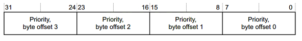  

| 位域  | 名                       | 读写 | 描述                                                         |
| ----- | ------------------------ | ---- | ------------------------------------------------------------ |
| 31:24 | Priority, byte  offset 3 | R/W  | 对于每一个中断，都有对应的8位数据用来描述：它的优先级。<br>每个优先级字段都对应一个优先级值，值越小，相应中断的优先级越高 |
| 23:16 | Priority,  byte offset 2 | R/W  |                                                              |
| 15:8  | Priority,  byte offset 1 | R/W  |                                                              |
| 7:0   | Priority,  byte offset 0 | R/W  |                                                              |

对于一个中断，如何设置它的优先级(Priority)，首先找到对应的GICD_IPRIORITYRn寄存器，即n是多少？还要确定使用这个寄存器里哪一个字节。

```
对于interrtups ID m，如下计算：
n = m DIV 4，GICD_IPRIORITYRn里的n就确定了；
GICD_IPRIORITYRn在GIC内部的偏移地址是多少？0x400+(4*n)
使用GICD_IPRIORITYRn中4个字节中的哪一个来表示interrtups ID m的优先级？
byte offset = m mod 4。
byte offset 0对应寄存器里的[7:0]；
byte offset 1对应寄存器里的[15:8]；
byte offset 2对应寄存器里的[23:16]；
byte offset 3对应寄存器里的[31:24]。
```

### 10. **Interrupt Processor Targets Registers, GICD_ITARGETSRn**

 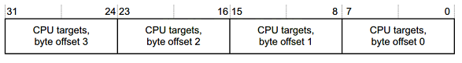 

| 位域  | 名                         | 读写 | 描述                                                         |
| ----- | -------------------------- | ---- | ------------------------------------------------------------ |
| 31:24 | CPU targets, byte offset 3 | R/W  | 对于每一个中断，都有8bit用来描述：中断=>哪些CPU，每一bit代表一个CPU<br>读GICD_ITARGETSR0～7时，读取任意字节，返回执行这个读操作的CPU的编号。 |
| 23:16 | CPU targets, byte offset 2 | R/W  |                                                              |
| 15:8  | CPU targets, byte offset 1 | R/W  |                                                              |
| 7:0   | CPU targets, byte offset 0 | R/W  |                                                              |

对于一个中断，如何设置它的目杯CPU？优先级(Priority)，首先找到对应的GICD_ITARGETSRn寄存器，即n是多少？还要确定使用这个寄存器里哪一个字节。

```
对于interrtups ID m，如下计算：
n = m DIV 4，GICD_ITARGETSRn里的n就确定了；
GICD_ITARGETSRn在GIC内部的偏移地址是多少？0x800+(4*n)
使用GICD_ITARGETSRn中4个字节中的哪一个来表示interrtups ID m的目标CPU？
byte offset = m mod 4。
byte offset 0对应寄存器里的[7:0]；
byte offset 1对应寄存器里的[15:8]；
byte offset 2对应寄存器里的[23:16]；
byte offset 3对应寄存器里的[31:24]。
```


### 11. **Interrupt Configuration Registers, GICD_ICFGRn**

 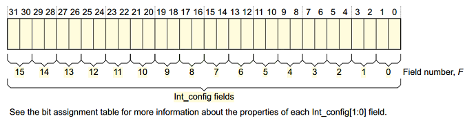 

| 位域          | 名                    | 读写 | 描述                                                         |
| ------------- | --------------------- | ---- | ------------------------------------------------------------ |
| [2*F*+1:2*F*] | Int_config, field *F* | R/W  | 对于每一个中断，都有对应的2位数据用来描述：它的边沿触发，还是电平触发。<br>对于Int_config [1]，即高位[2F + 1]，含义为：  0：相应的中断是电平触发；  1：相应的中断是边沿触发。<br>对于Int_config [0]，即低位[2F]，是保留位。 |


对于一个中断，如何找到GICD_ICFGRn并确定相应的位域F？

```
对于interrtups ID m，如下计算：
n = m DIV 16，GICD_ICFGRn里的n就确定了；
GICD_ICACTIVERn 在GIC内部的偏移地址是多少？0xC00+(4*n)
F = m mod 16。
```


### 12. **Identification registers: Peripheral ID2 Register, ICPIDR2**

  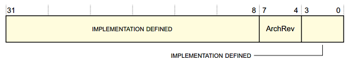 

| 位域   | 名      | 读写 | 描述                                                      |
| ------ | ------- | ---- | --------------------------------------------------------- |
| [31:0] | -       | R/W  | 由实现定义                                                |
| [7:4]  | ArchRev | R    | 该字段的值取决于GIC架构版本：  0x1：GICv1；  0x2：GICv2。 |
| [3:0]  | -       | R/W  | 由实现定义                                                |

 

## CPU interface寄存器描述

### 1. **CPU Interface Control Register, GICC_CTLR**

	此寄存器用来控制CPU interface传给CPU的中断信号。对于不同版本的GIC，这个寄存器里各个位的含义大有不同。以GICv2为例，有如下2种格式：

  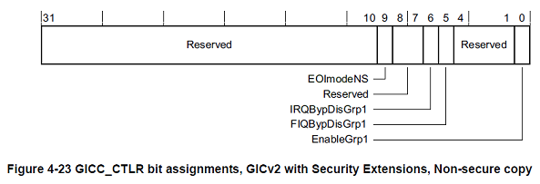 

  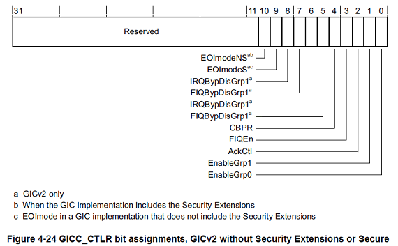 

	以`GIC2 with Security Extensions, Non-secure copy` 为例，GICC_CTLR中各个位的定义如下：

| 位域    | 名            | 读写 | 描述                                                         |
| ------- | ------------- | ---- | ------------------------------------------------------------ |
| [31:10] | -             |      | 保留                                                         |
| [9]     | EOImodeNS     | R/W  | 控制对GICC_EOIR和GICC_DIR寄存器的非安全访问：  <br>0：GICC_EOIR具有降低优先级和deactivate中断的功能；  对GICC_DIR的访问是未定义的。<br>1：GICC_EOIR仅具有降低优先级功能；  GICC_DIR寄存器具有deactivate中断功能。 |
| [8:7]   | -             |      | 保留                                                         |
| [6]     | IRQBypDisGrp1 | R/W  | 当CPU interface的IRQ信号被禁用时，该位控制是否向处理器发送bypass IRQ信号： <br/>0：将bypass IRQ信号发送给处理器； <br/>1：将bypass IRQ信号不发送到处理器。 |
| [5]     | FIQBypDisGrp1 | R/W  | 当CPU interface的FIQ信号被禁用时，该位控制是否向处理器发送bypass FIQ信号： <br/>0：将bypass FIQ信号发送给处理器； <br/>1：旁路FIQ信号不发送到处理器 |
| [4:1]   | -             |      | 保留                                                         |
| [0]     | -             | R/W  | 使能CPU interface向连接的处理器发出的组1中断的信号:  0：禁用中断信号  1：使能中断信号 |

### 2. **Interrupt Priority Mask Register, GICC_PMR**

	提供优先级过滤功能，优先级高于某值的中断，才会发送给CPU。

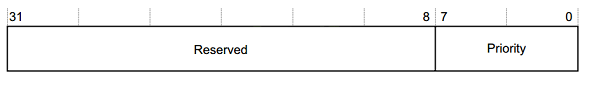 


| 位域   | 名   | 读写 | 描述                                  |
| ------ | ---- | ---- | ------------------------------------- |
| [31:8] | -    |      | 保留                                  |
| [7:0]  | -    | R/W  | 优先级高于这个值的中断，才会发送给CPU |

`[7:0]`共8位，可以表示256个优先级。但是某些芯片里的GIC支持的优先级少于256个，则某些位为RAZ / WI，如下所示：

```
如果有128个级别，则寄存器中bit[0] = 0b0，即使用[7:1]来表示优先级；
如果有64个级别，则寄存器中bit[1:0] = 0b00，即使用[7:2]来表示优先级；
如果有32个级别，则寄存器中bit[2:0] = 0b000，即使用[7:3]来表示优先级；
如果有16个级别，则寄存器中bit[3:0] = 0b0000，即使用[7:4]来表示优先级；
```

注意：**imx6ull最多为32个级别**

### 3. **Binary Point Register, GICC_BPR**

	此寄存器用来把8位的优先级字段拆分为组优先级和子优先级，组优先级用来决定中断抢占。

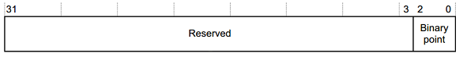 

| 位域   | 名            | 读写 | 描述                                                         |
| ------ | ------------- | ---- | ------------------------------------------------------------ |
| [31:3] | -             |      | 保留                                                         |
| [2:0]  | Binary  point | R/W  | 此字段的值控制如何将8bit中断优先级字段拆分为组优先级和子优先级，组优先级用来决定中断抢占。 |

### 4. **Interrupt Acknowledge Register, GICC_IAR**

	CPU读此寄存器，获得当前中断的interrtup ID。

 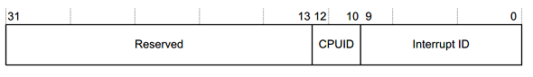 

| 位域    | 名           | 读写 | 描述                                                         |
| ------- | ------------ | ---- | ------------------------------------------------------------ |
| [31:13] | -            |      | 保留                                                         |
| [12:10] | CPUID        | R    | 对于SGI类中断，它表示谁发出了中断。如，值为3表示该请求是通过对CPU  interface 3上的GICD_SGIR的写操作生成的。 |
| [9:0]   | Interrupt ID | R    | 中断ID                                                       |

### 5. **Interrupt Register, GICC_EOIR**

	写此寄存器，表示某中断已经处理完毕。GICC_IAR的值表示当前在处理的中断，把GICC_IAR的值写入GICC_EOIR就表示中断处理完了。

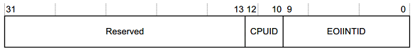 

| 位域    | 名       | 读写 | 描述                                           |
| ------- | -------- | ---- | ---------------------------------------------- |
| [31:13] | -        |      | 保留                                           |
| [12:10] | CPUID    | W    | 对于SGI类中断，它的值跟GICD_IAR. CPUID的相同。 |
| [9:0]   | EOIINTID | W    | 中断ID，它的值跟GICD_IAR里的中断ID相同         |