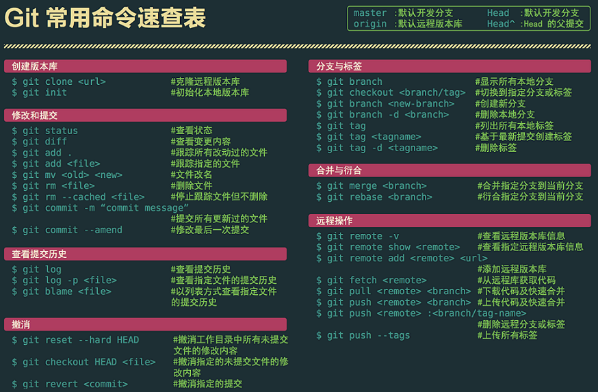

## git命令速查表



## 补充

```shell
$ git reflog						#查看包括回退之前的所有记录，用于将代码从回退拉到最新
$ git reset --hard <commitID>		#回退到指定commandID
$ git checkout -b <name <template>	#以template(分支或commit)为模板，以name为名创建新分支，若无第二参数，默认当前分支
$ git rebase <name>					#变基name为主导如master，将切出来的分支的基commit后移
$ git rebase --continue				#继续下一个commit的rebase
$ git stash							#暂存修改过的文件
$ git stash pop
#merge的时候一定要先pull
```

### 从命令行创建一个新的仓库

```shell
touch README.md
git init

git add README.md
git commit -m "first commit"
git remote add origin http://192.168.10.138:8081/seehi_SW/testSuite.git
git push -u origin master
```

