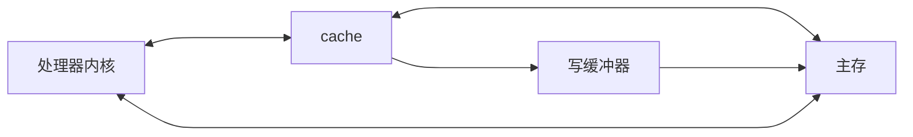

# 1  



## 9.1 框架描述

**a. 定义中断上半部处理函数，并返回IRQ_WAKE_THREAD**

```c
static irqreturn_t xxx_isr(int irq, void *dev_id)
{
	//...
	return IRQ_WAKE_THREAD;
}
```

**b. 定义中断下半部处理函数，并返回IRQ_HANDLED**

```c
static irqreturn_t xxx_thread_func(int irq, void *dev_id)
{
	//...	
	return IRQ_HANDLED;
}
```

**c. probe函数中调用request_threaded_irq初始化中断**

```c
int request_threaded_irq(unsigned int irq, irq_handler_t handler,
			 irq_handler_t thread_fn, unsigned long irqflags,
			 const char *devname, void *dev_id);
//e.g.
err = request_threaded_irq(irq, xxx_isr, xxx_thread_func, IRQF_TRIGGER_RISING, "xxx", &data);
```

​        其中参数**irq**代表中断号，参数**irqflags**代表触发中断的条件，对于GPIO有**IRQF_TRIGGER_RISING**和**IRQF_TRIGGER_FALLING**。
**d. remove函数中调用free_irq释放中断**

```c
void free_irq(unsigned int irq, void *dev_id);
```

