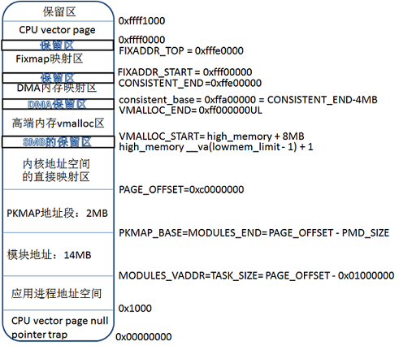
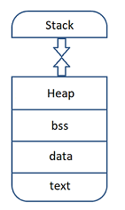
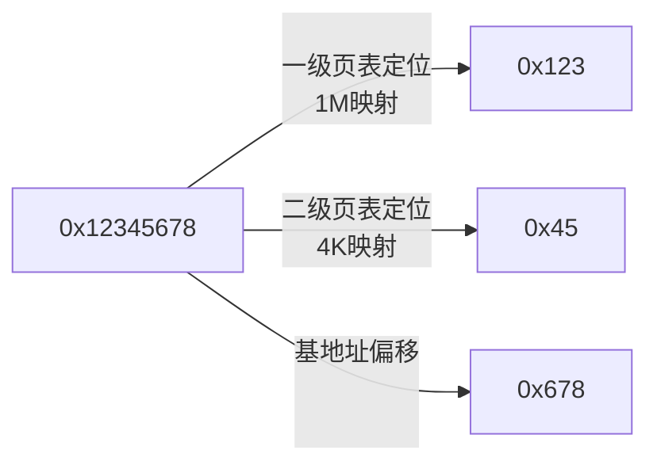
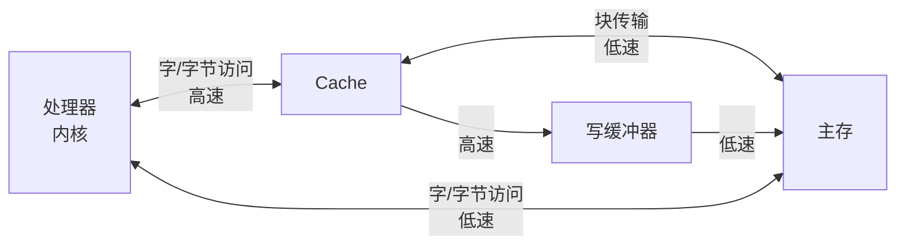

参考资料

* arm linux内存分布  https://blog.csdn.net/dahailantian1/article/details/78584846

## 0. Arm Linux内存管理

* Linux以页为内存管理基本单元，以PAGESIZE定义，一般为0x1000，即4k

### 0.1 Arm LInux内存分区

内存空间粗分为用户空间和内核空间，用户空间分布一般为0-3GB(PAGE_OFFSET)，以0xc0000000为分界，内核空间的虚拟地址被所有进程所共享

**内存分布情况如下**




**应用进程地址空间**



### 0.2 虚拟地址于物理地址互转

```c
unsigned long virt_to_phys(volatile void *address);
void *phys_to_virt(unsigned long address);
```

这两个函数只适合DMA映射区及直接映射区

### 0.3 动态申请内存空间(带z代表自动memset)

**kmalloc（连续）**

```c
void *kmalloc(size_t size, gfp_t flags);
void * devm_kmalloc(struct device *dev, size_t size, gfp_t gfp);
void * devm_kcalloc(struct device * dev, size_t n, size_t size, gfp_t flags)
void *kzalloc(size_t size, gfp_t flags);
void kfree(const void *objp);
```

flags通常是GFP_KERNEL，但无法申请时，进程会睡眠，因此在中断上下文或持有自旋锁的时候，不能使用，应该用GFP_ATOMIC

**vmalloc（非连续）**

```c
void *vmalloc(unsigned long size);
void *vzalloc(unsigned long size);
void vfree(const void * addr);
```

该种方式开销较大，小空间分配最好别用，一般为无硬件意义的缓冲区分配内存

**slab**

可以保留任意数目且全部同样大小的后被缓存，用来解决以页为基本单位造成的内存浪费


## 1. MMU二级页表映射关系





## 2. 带cache的系统数据传输机制



### 2.1 写入的四种方式

 根据是否使用**Cache**和**写缓冲器**可产生四种写数据的组合。

| enable Cache? | enable Write Buffer? | Explain                         |
| ------------- | -------------------- | ------------------------------- |
| 0             | 0                    | Non-cached, non-buffered (NCNB) |
| 0             | 1                    | write-combine(WC)               |
| 1             | 0                    | Cached, write-through mode (WT) |
| 1             | 1                    | Cached, write-back mode (WB)    |

方式1：读写直达硬件，适合寄存器的读写。

方式2：读写经写缓冲器写入内存，可能会发生写合并现象，适合显存等不需要读的操作。

方式3：适合于只读设备。

方式4：适合于一般的内存读写。

### 2.2 禁用Cache的场合

**Register**、**FrameBuffer**、**DMA**等需要数据一直是同步的情况。

## 3. io映射及读写

### 3.1 io映射

```c
void __iomem *ioremap(resource_size_t res_cookie, size_t size);
void __iomem *devm_ioremap(struct device *dev, resource_size_t offset, resource_size_t size);
void iounmap(volatile void __iomem *cookie);
```

### 3.2 io读写

```c
u8 readb(const volatile void __iomem *addr);
u16 readw(const volatile void __iomem *addr);
u32 readl(const volatile void __iomem *addr);
void writeb(u8 value, volatile void __iomem *addr);
void writew(u16 value, volatile void __iomem *addr);
void writel(u32 value, volatile void __iomem *addr);
//后接__relaxed表示不加内存屏障
```

## 4. mmap机制

### 4.0 引言

对于需要大量数据读写的操作，常规的read和write太过耗时和繁琐，因此需要一种直接读写内存的方式，这种方式就是**mmap**，即内存映射。

### 4.1 驱动程序需要做的事情

**1. 确定物理地址（分配）**

**2. 确定属性：是否使用Cache、Buffer**

**3. 建立映射关系**

根据以上三步,即可完成内核态的程序编写.

### 4.2 框架描述-内核态

**a. 定义编写xxx_drv_mmap函数并初始化file_operations结构体**

```c
static int xxx_drv_mmap(struct file *file, struct vm_area_struct *vma)
{
	/* get physic address */
	unsigned long phy = virt_to_phys(kernel_buf);
	/* set property: cache, buffer */
	vma->vm_page_prot = pgprot_writecombine(vma->vm_page_prot);
	/* map */
	if (remap_pfn_range(vma, vma->vm_start, phy >> PAGE_SHIFT,		/* divide page size */
			    vma->vm_end - vma->vm_start, vma->vm_page_prot)) {
		printk("mmap remap_pfn_range failed\n");
		return -ENOBUFS;
	}
	return 0;
}
static struct file_operations xxx_fops = {
	.owner	 = THIS_MODULE,
	.mmap    = xxx_drv_mmap,
};
```

**b. 在probe函数中调用kmalloc分配内存**

```c
//In global
static char *kernel_buf;
static int bufsiz = 1024*8;
//In probe
kernel_buf = kmalloc(bufsiz, GFP_KERNEL);
```

**c. 调用virt_to_phys获取物理地址**

```c
unsigned long phy = virt_to_phys(kernel_buf);
```

**d. 设置属性**

```c
#define L_PTE_MT_UNCACHED	(_AT(pteval_t, 0) << 2)	/* strongly ordered */
#define L_PTE_MT_BUFFERABLE	(_AT(pteval_t, 1) << 2)	/* normal non-cacheable */
#define L_PTE_MT_WRITETHROUGH	(_AT(pteval_t, 2) << 2)	/* normal inner write-through */
#define L_PTE_MT_WRITEBACK	(_AT(pteval_t, 3) << 2)	/* normal inner write-back */
#define L_PTE_MT_WRITEALLOC	(_AT(pteval_t, 7) << 2)	/* normal inner write-alloc */
#define L_PTE_MT_MASK		(_AT(pteval_t, 7) << 2)
//e.g.
#define pgprot_noncached(prot) \
	__pgprot_modify(prot, L_PTE_MT_MASK, L_PTE_MT_UNCACHED)
```

**e. 调用remap_pfn_range建立映射关系**

```c
int remap_pfn_range(struct vm_area_struct *vma, unsigned long addr,
		    unsigned long pfn, unsigned long size, pgprot_t prot);
//e.g.
if (remap_pfn_range(vma, vma->vm_start, phy >> PAGE_SHIFT,		/* divide page size */ 
                    vma->vm_end - vma->vm_start, vma->vm_page_prot)) {
    printk("mmap remap_pfn_range failed\n");
    return -ENOBUFS;
}
```
其中参数**pfn**表示物理地址,这里要除以页的大小,使用**PAGE_SHIFT**宏即可.

**f. 在remove函数中调用kfree分配内存**

```c
kfree(kernel_buf);
```

### 4.3 框架描述-用户态

**a. 调用mmap获取内存**

```c
void *mmap(void *addr, size_t length, int prot, int flags, int fd, off_t offset);
//e.g.
buf =  mmap(NULL, 1024*8, PROT_READ | PROT_WRITE, MAP_SHARED, fd, 0);
if (buf == MAP_FAILED)
{
    return -1;
}
```

**b. 对获取的内存进行自己想要的操作**

```c
//In global
static char *kernel_buf;
static int bufsiz = 1024*8;
//In probe
kernel_buf = kmalloc(bufsiz, GFP_KERNEL);
```

**c. 调用munmap释放内存**

```c
int munmap(void *addr, size_t length);
```
